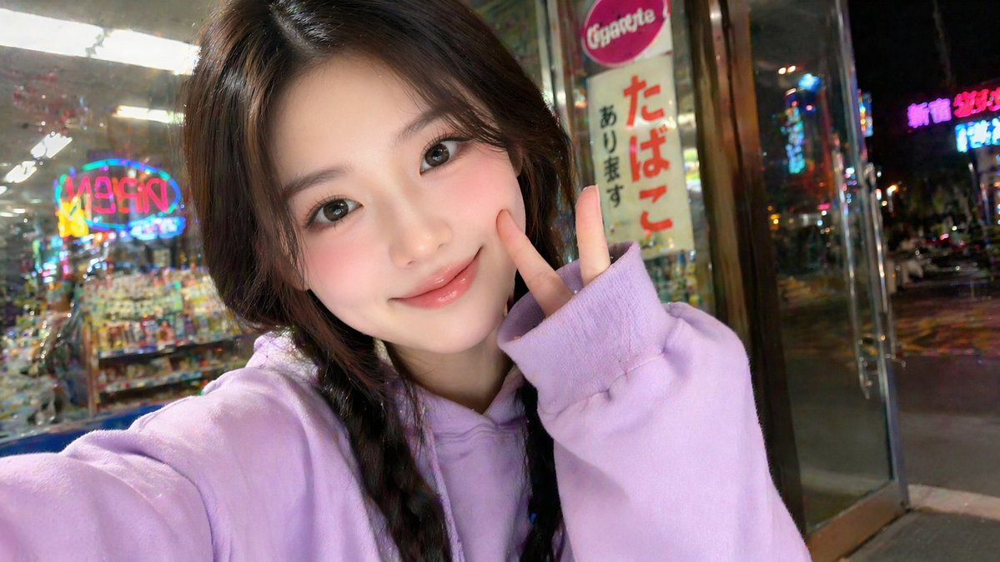
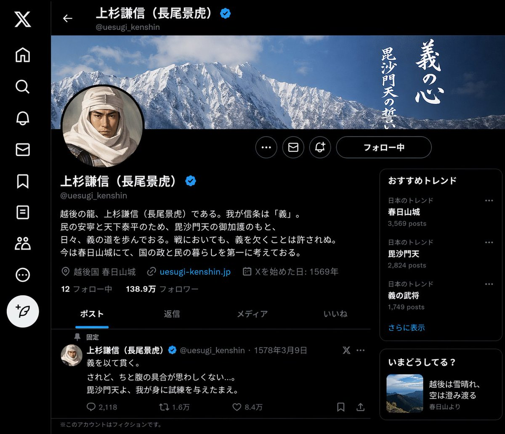

# Awesome GPT-Image-2 Prompts

[](https://awesome.re)


> A GPT-Image-2-only prompt library built around one rule: one local image, one visible prompt, one source record.

This repository no longer mixes models.

Current snapshot date: 2026-04-17.

The scope is now intentionally narrow:

- GPT-Image-2 prompt-image pairs from X
- GPT-Image-2 secondary web examples kept as reference only
- a flattened one-image-to-one-prompt dataset that is easier to reuse downstream

## What Is Here

- [GPT-Image-2 X Prompt Pairs](./collections/gpt-image-2-prompt/README.md): browse layer
- [Flattened X dataset](./data/gpt-image-2/x-prompt-image-pairs.json): 46 one-to-one records
- [Grouped X source records](./data/gpt-image-2/x-discussions-verified.json): 32 verified post-level records
- [Arena-likely X sample](./data/gpt-image-2/x-arena-likely.json): 1 lower-confidence pair
- [Secondary web examples](./data/gpt-image-2/web-examples-secondary.json): 16 non-X reference items

## Latest Sweep

The repository now explicitly covers the newest pull window from `2026-04-15` to `2026-04-17`:

- 20 verified X posts in that date range
- 22 prompt-image pairs in that date range
- direct prompt text in post body whenever possible
- one OCR-assisted case where the prompt appeared in an attached screenshot
- five same-thread cases where the full prompt lived in the author's reply thread

## Cover Gallery

| 1 | 2 | 3 |
| --- | --- | --- |
| [](./collections/gpt-image-2-prompt/README.md#latest-additions-2026-04-15-to-2026-04-17) | [](./collections/gpt-image-2-prompt/README.md#latest-additions-2026-04-15-to-2026-04-17) | [](./collections/gpt-image-2-prompt/README.md#latest-additions-2026-04-15-to-2026-04-17) |
| [](./collections/gpt-image-2-prompt/README.md#latest-additions-2026-04-15-to-2026-04-17) | [](./collections/gpt-image-2-prompt/README.md#latest-additions-2026-04-15-to-2026-04-17) | [](./collections/gpt-image-2-prompt/README.md#latest-additions-2026-04-15-to-2026-04-17) |

## Data Model

The repository now has two layers:

- browse layer: curated Markdown gallery for humans
- truth layer: flat JSON records where each entry is exactly one image and one prompt

That means multi-image X posts are normalized into multiple pair records rather than one grouped blob.

## Why This Shape

Most social prompt collections fail in one of two ways:

- they keep screenshots and lose the exact prompt mapping
- they keep the post-level thread but make downstream reuse harder

This repo keeps both:

- grouped source files for provenance
- pair-level records for production reuse

## Sourcing Rule

We only publish pairs when the prompt is visible in or confidently attributable to the original X post.

If a post contains three generated images from one prompt, it becomes three pair records.

The sourcing rule is documented inline in this README and enforced in the JSON records.

## Repository Structure

```text
awesome-gptimage2-prompts/
  README.md
  assets/
    gpt-image-2-x-discussions/
    gpt-image-2-x-arena-likely/
    gpt-image-2-web-examples/
  collections/
    gpt-image-2-prompt/
      README.md
  data/
    gpt-image-2/
      README.md
      x-prompt-image-pairs.json
      x-discussions-verified.json
      x-arena-likely.json
      web-examples-secondary.json
```

## Contributing

Contributions are welcome, but the bar is strict:

- GPT-Image-2 only
- source-first attribution
- visible or defensibly mapped prompts
- one image per final pair record

Read [CONTRIBUTING.md](./CONTRIBUTING.md) before adding new items.
