<!-- Generated by scripts/build_gallery.py -->
# Awesome GPT-Image-2 Prompts

[](https://awesome.re)


> Scroll through 86 source-post cards and 111 curated GPT-Image-2 results, open any card, and copy the prompt directly into your own image workflow.

Gallery build date: 2026-04-23. Latest source post date: 2026-04-22.

[Browse Collection](./collections/gpt-image-2-prompt/README.md) • [Download JSON](./prompts/prompts.json)

## What This Repo Is For

This repository is designed for one behavior: see an image effect you like, open the prompt, copy it, and run your own GPT-Image-2 generation.

The homepage is intentionally long and visual so GitHub visitors can keep scrolling through real examples instead of reading a short description and bouncing.

## How To Use It

1. Scroll until you find an image effect you want to recreate.
2. Open `Copy Prompt` under that card.
3. Copy the full prompt into GPT-Image-2 and adapt the subject if needed.

## Stats

| Metric | Count |
| --- | ---: |
| Source-post cards | 86 |
| Prompt-image pairs | 111 |

## Recent Highlights

- `Boyfriend Pov Korean Idol Portrait`: 9:16 vertical — Korean idol intimate portrait, single subject, boyfriend POV soft black mist filter, glowing highlights, gentle bloom, sl...
- `Eastern Fantasy Woman Portrait`: 东方幻想风格女性，半身肖像，回眸侧脸，气质空灵优雅，柔和神性美感，细腻五官，微垂眼神，冷白细腻肌肤，淡雅橘粉妆容，金色高光点缀 长发飘动，发丝中融入彩色花朵与光粒（红、蓝、橙、紫），头发具有流动感与空气感 身穿半透明丝绸礼服与披肩，材质轻盈通透，布料随风飘动，表面带有鎏金纹...
- `Forced Perspective Korean Idol Portrait`: 9:16 vertical — creative forced perspective portrait, Korean idol style, single subject analog 35mm film aesthetic, soft natural grain, s...
- `Fuji Couple 3X3 Grid Collage`: 9:16 vertical — Japanese Fuji film style couple portrait, 3x3 grid (nine frames), same couple in all images, consistent facial features a...
- `Mirror Editorial Portrait`: Stunningly beautiful woman with a cool, aloof atmospheric vibe, exquisite and refined facial features, cold and glamorous high-end face,...
- `Window Side Sweet Cool Beauty Portrait`: Sweet-cool atmospheric beauty, soft alluring look, tall and slender figure Scene: indoor window-side setting, white sheer curtains, soft...

## Cover Gallery

| 1 | 2 | 3 |
| --- | --- | --- |
| <a href="#lego-poster-every-us-president-by-year">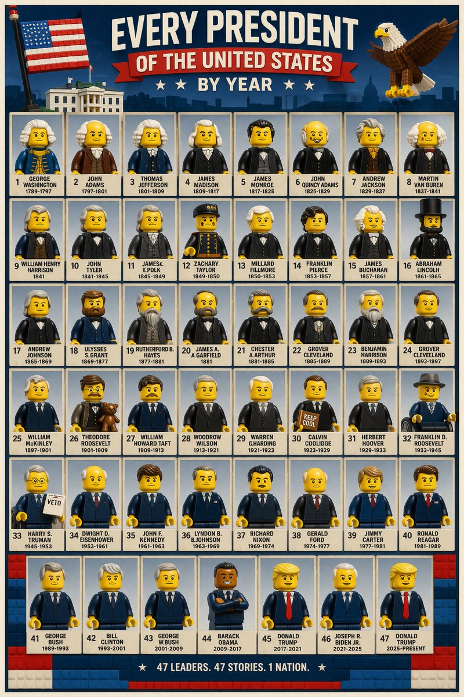</a> | <a href="#japanese-onsen-ryokan-portrait">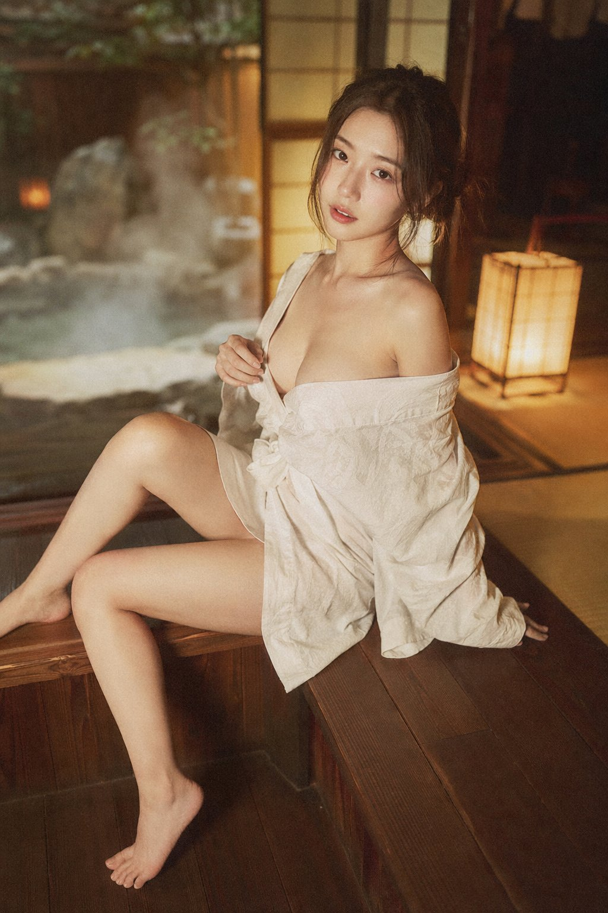</a> | <a href="#gorilla-knowledge-worker-movie-poster">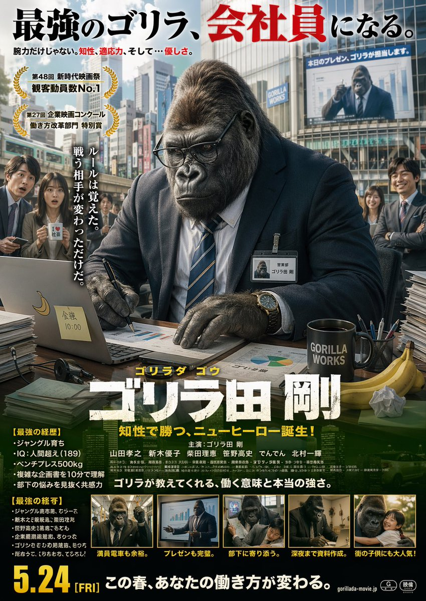</a> |
| <a href="#a16z-podcast-youtube-screengrab"></a> | <a href="#refracted-sans-crystal-typeface"></a> | <a href="#capless-perfume-bottle"></a> |
| <a href="#crownless-watch-sealed-case"></a> | <a href="#chengdu-food-map-illustration"></a> | <a href="#tim-cook-apple-park-keynote"></a> |

## Browse Prompts

### #1 Boyfriend Pov Korean Idol Portrait

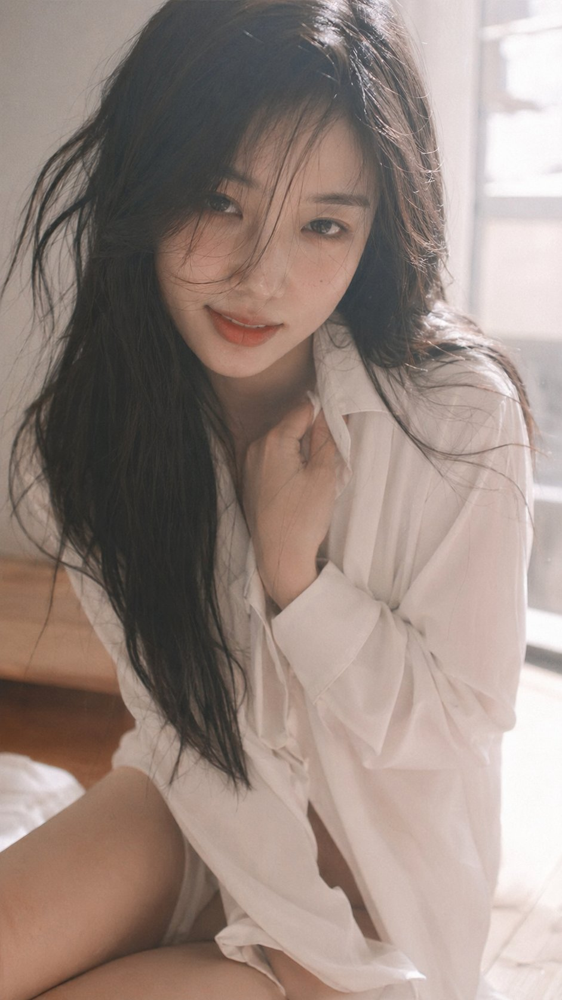

- **Author:** [BubbleBrain](https://x.com/BubbleBrain)
- **Source:** [X](https://x.com/BubbleBrain/status/2046758832131461255)
- **Published:** April 22, 2026
- **Languages:** en

<details>
<summary>Copy Prompt</summary>

```text
9:16 vertical — Korean idol intimate portrait, single subject, boyfriend POV
soft black mist filter, glowing highlights, gentle bloom, slight overexposure, soft haze, lowered contrast, creamy tones
close distance framing, intimate perspective, slight handheld feeling
young Korean female idol, natural soft makeup, dewy realistic skin texture, subtle imperfections
outfit: oversized white shirt slightly loose and relaxed + short bottoms, soft fabric, naturally draped, no revealing elements
hair: long dark hair, slightly messy, soft movement around face
pose: sitting or leaning slightly forward toward camera, upper body subtly angled; one hand resting lightly near collarbone or gently holding shirt edge, the other relaxed; shoulders loose, slight natural body curve
expression: soft playful smile, slightly parted lips, warm eye contact with camera, hint of teasing intimacy
camera: close-up to mid-body framing, eye-level or slightly lower angle, as if viewer is right in front of her
lighting: warm diffused window light, soft highlight bloom on skin, gentle shadows, slight lens flare or light leak
mood: intimate, romantic, subtly seductive, “caught in a private moment” feeling
quality: ultra-realistic, fine film grain, slight motion blur, imperfect framing, dreamy cinematic softness
```

</details>

---

### #2 Eastern Fantasy Woman Portrait

| View 1 | View 2 |
| --- | --- |
| 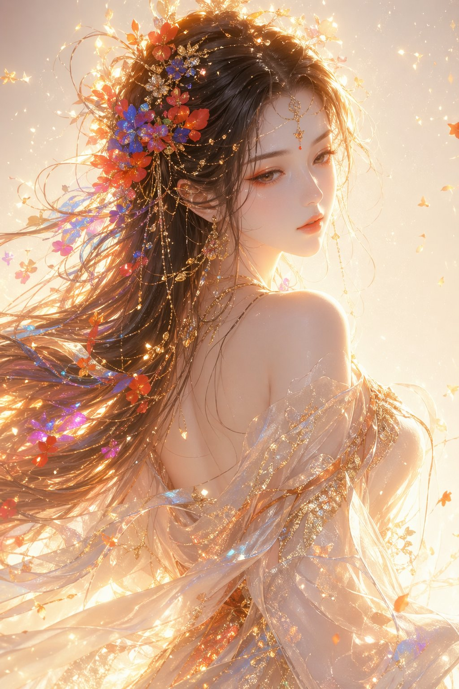 |  |

- **Author:** [李岳](https://x.com/liyue_ai)
- **Source:** [X](https://x.com/liyue_ai/status/2046962895775580442)
- **Published:** April 22, 2026
- **Languages:** zh, en

<details>
<summary>Copy Prompt</summary>

```text
东方幻想风格女性，半身肖像，回眸侧脸，气质空灵优雅，柔和神性美感，细腻五官，微垂眼神，冷白细腻肌肤，淡雅橘粉妆容，金色高光点缀
长发飘动，发丝中融入彩色花朵与光粒（红、蓝、橙、紫），头发具有流动感与空气感
身穿半透明丝绸礼服与披肩，材质轻盈通透，布料随风飘动，表面带有鎏金纹理与闪耀颗粒。
整体光影为暖金色逆光，强边缘光，体积光明显，光粒漂浮，柔光泛光，梦幻氛围
背景干净浅色渐变，带微光与粒子效果，整体氛围空灵、梦境、神圣
风格：高端CG插画，超精细，电影级光影，柔光渲染，8K细节，artstation 热门作品风格
```

</details>

---

### #3 Forced Perspective Korean Idol Portrait

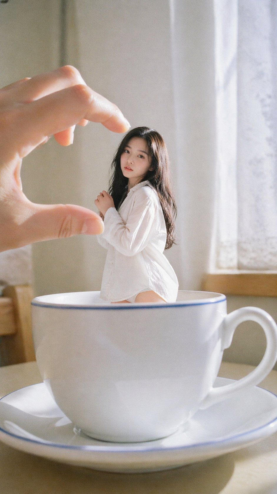

- **Author:** [BubbleBrain](https://x.com/BubbleBrain)
- **Source:** [X](https://x.com/BubbleBrain/status/2047038657295798701)
- **Published:** April 22, 2026
- **Languages:** en

<details>
<summary>Copy Prompt</summary>

```text
9:16 vertical — creative forced perspective portrait, Korean idol style, single subject
analog 35mm film aesthetic, soft natural grain, slightly faded colors, gentle overexposure, pastel tones, low contrast, soft highlight bloom, airy and dreamy atmosphere
minimal indoor setting near a window, clean light-toned background, simple everyday environment
young Korean female idol, very attractive, natural minimal makeup, dewy realistic skin texture, subtle imperfections
outfit: oversized white shirt loosely draped + short bottoms, soft fabric, relaxed fit, modest but subtly body-shaping, no revealing elements
hair: long dark hair, slightly messy, natural volume
composition (key): forced perspective illusion — the subject appears unusually small relative to nearby objects (such as being inside a cup, standing on a table edge, or interacting with a hand in the foreground), but still realistic; scale ambiguity created by camera distance and alignment
camera: slightly low or eye-level angle, intentional perspective distortion, foreground object close to lens, subject placed farther away to create size illusion
pose: natural relaxed posture, slight body curve, casual stance or light sitting pose
expression: soft calm gaze, slight smile or slightly parted lips, natural and unposed
lighting: diffused natural window light, soft shadows, gentle light wrapping around subject
mood: playful, slightly surreal but grounded in reality, intimate everyday moment with a visual twist
quality: ultra-realistic, fine film grain, slight softness, imperfect framing, natural imperfections
```

</details>

---

### #4 Fuji Couple 3X3 Grid Collage

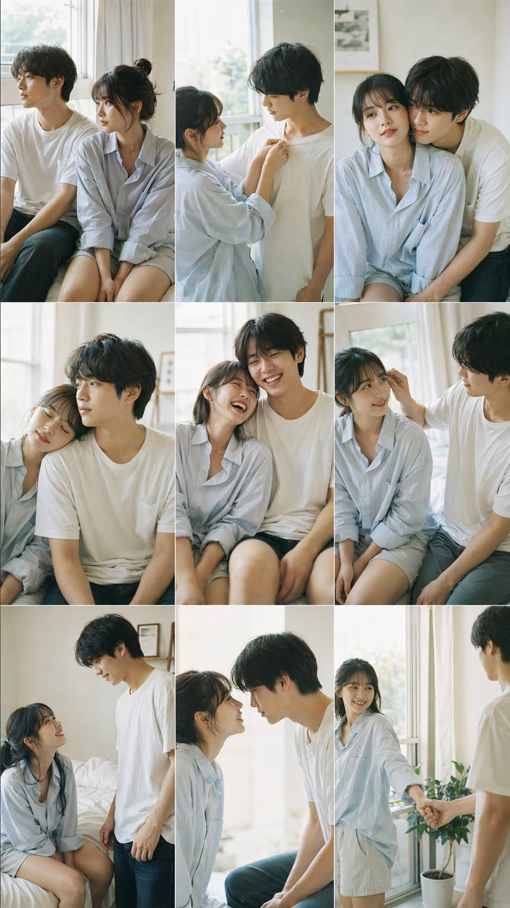

- **Author:** [BubbleBrain](https://x.com/BubbleBrain)
- **Source:** [X](https://x.com/BubbleBrain/status/2046795665989304577)
- **Published:** April 22, 2026
- **Languages:** en

<details>
<summary>Copy Prompt</summary>

```text
9:16 vertical — Japanese Fuji film style couple portrait, 3x3 grid (nine frames), same couple in all images, consistent facial features and styling
Fujifilm analog aesthetic (Pro 400H / Superia feel), soft pastel tones, slight green-magenta shift, low contrast, gentle highlight roll-off, fine film grain, subtle halation, slight vignette
bright natural daylight, diffused sunlight through window, soft shadows, airy atmosphere
young Japanese couple, natural minimal makeup, realistic skin texture, slight imperfections
female outfit: oversized button-up shirt with loose shorts, relaxed fit, soft casual styling
male outfit: simple t-shirt or light shirt, clean and understated
hair: natural, slightly tousled for both
setting: minimal indoor near window, light curtains, clean soft background, everyday environment
camera: intimate distance, mostly waist-up framing, eye-level, slight handheld feel
lighting: diffused daylight, gentle highlight bloom, soft shadow transitions
mood: warm, natural, romantic, candid everyday intimacy
Frame breakdown (3x3 grid — varied actions):
Top row: - Top left: sitting side by side but slightly apart, both looking away, quiet moment - Top center: girl lightly pulling or adjusting the boy’s shirt collar, playful gesture - Top right: boy leaning behind her, chin slightly near her shoulder, relaxed closeness
Middle row: - Center left: girl resting her head lightly on his shoulder, calm and soft - Center: both laughing naturally, mid-motion candid moment - Center right: boy gently brushing or tucking her hair behind her ear
Bottom row: - Bottom left: girl sitting on bed or chair, boy standing close, looking down at her - Bottom center: girl leaning forward slightly, boy meeting her halfway, faces very close (almost touching, no explicit contact) - Bottom right: girl turning away slightly while holding his hand, subtle movement, natural connection
quality: ultra-realistic, analog film look, fine grain, slight softness, natural imperfections
```

</details>

---

### #5 Mirror Editorial Portrait

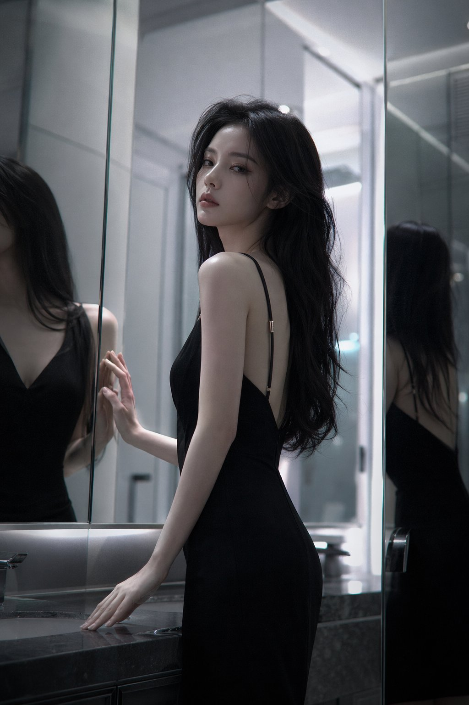

- **Author:** [BubbleBrain](https://x.com/BubbleBrain)
- **Source:** [X](https://x.com/BubbleBrain/status/2046900795229217063)
- **Published:** April 22, 2026
- **Languages:** en

<details>
<summary>Copy Prompt</summary>

```text
Stunningly beautiful woman with a cool, aloof atmospheric vibe, exquisite and refined facial features, cold and glamorous high-end face, long flowing hair, graceful and alluring figure, (character features completely locked and consistent)
Scene: Indoor space with mirrors (bathroom or mirrored wall), multiple reflections, layered depth in the space
Pose: Standing in front of the mirror, one hand lightly touching the mirror surface or resting on the countertop, body slightly angled, head gently turned toward the camera
Expression: Calm and emotionless, with a hint of cold indifference and detachment
Camera angle: Low angle or slight side angle shot, with the mirror reflection clearly visible in the frame
Lighting: Cool white light as the main source, with localized shadows, emphasizing structural contours and three-dimensionality
Style: High-end fashion editorial, subtle film grain, low contrast
Details: Delicately realistic skin texture, clear yet softly layered and slightly blurred mirror reflections
Atmosphere: Restrained, rational, distant, with a touch of surreal unreality
Quality: Ultra-sharp 8K, extreme details, cinematic lighting and shadows, beautiful depth-of-field bokeh
```

</details>

---

### #6 Window Side Sweet Cool Beauty Portrait

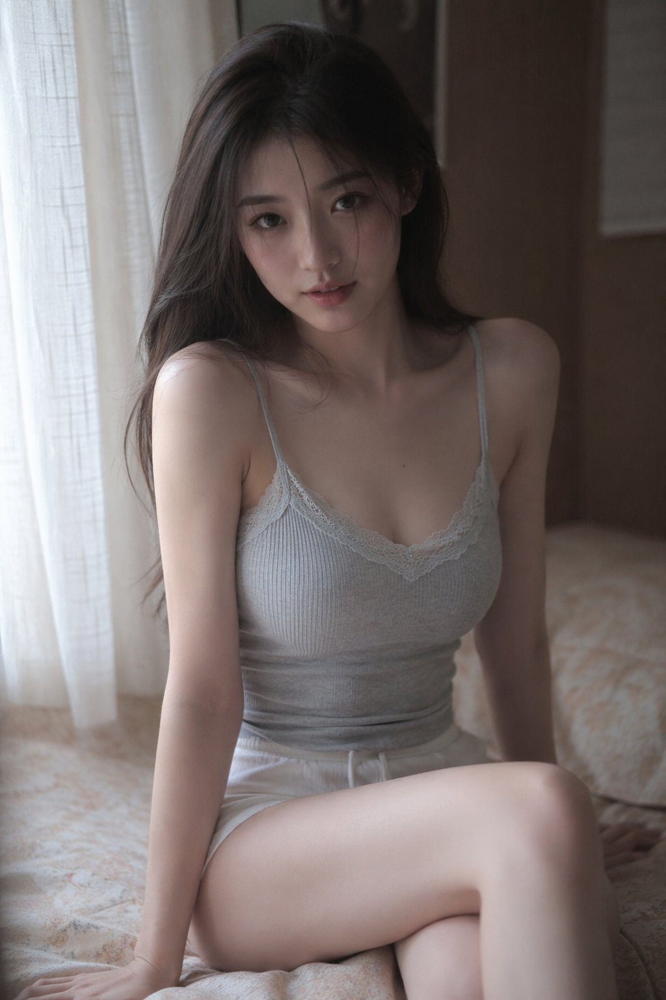

- **Author:** [BubbleBrain](https://x.com/BubbleBrain)
- **Source:** [X](https://x.com/BubbleBrain/status/2046848851227845108)
- **Published:** April 22, 2026
- **Languages:** en

<details>
<summary>Copy Prompt</summary>

```text
Sweet-cool atmospheric beauty, soft alluring look, tall and slender figure
Scene: indoor window-side setting, white sheer curtains, soft natural light filtering in, quiet and private space with a subtle lived-in feel
Pose: sitting by the window or on the edge of a bed, body slightly leaning forward; one hand gently supporting behind, the other naturally relaxed and hanging down; legs slightly crossed, posture relaxed and natural
Expression: lightly looking toward the camera, with a faint, almost imperceptible smile; restrained emotion yet subtly attractive
Style: low contrast, shot on a Nikon DSLR
Details: realistic skin texture, delicate but not over-smoothed, slightly messy natural hair, straight-out-of-camera feel
Atmosphere: quiet, intimate, slightly ambiguous, everyday intimacy
Framing: medium close-up, waist-up composition, slight handheld feeling, shallow depth of field with background blur
Quality: high-definition, photorealistic, low-light ambiance, authentic photography texture
Aspect ratio: 2:3
```

</details>

---

### #7 Backpropagation Explainer Infographic

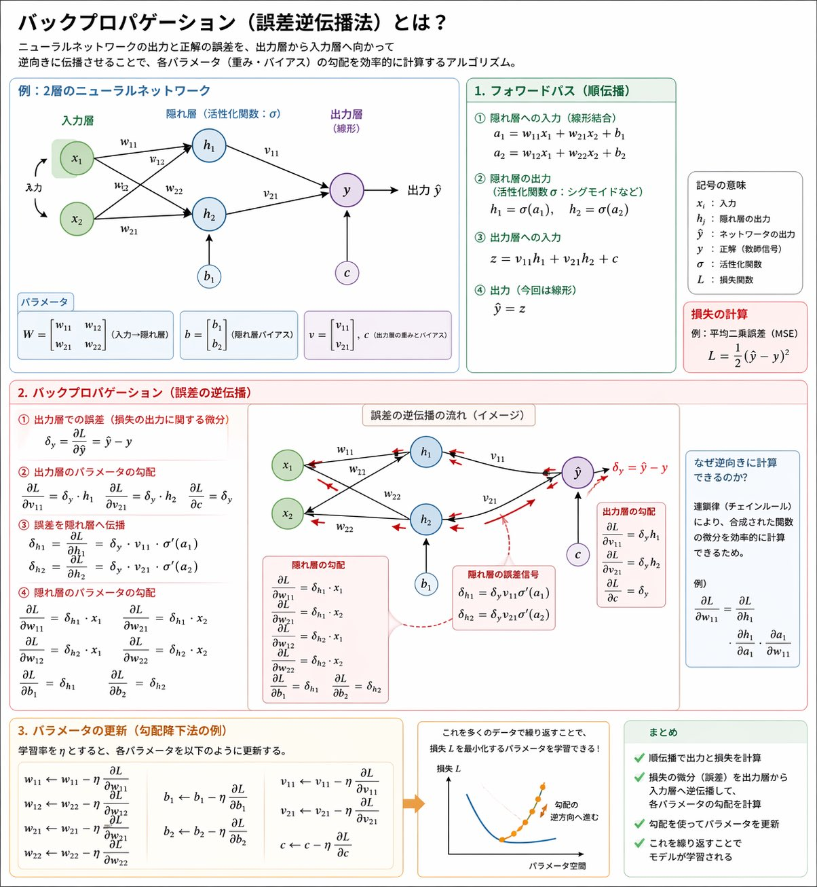

- **Author:** [IT navi](https://x.com/itnavi2022)
- **Source:** [X](https://x.com/itnavi2022/status/2046494262158930154)
- **Published:** April 21, 2026
- **Languages:** ja

<details>
<summary>Copy Prompt</summary>

```text
バックプロパゲーションについて詳しく図解して
```

</details>

---

### #8 Barbecue Three Sword Style Portrait

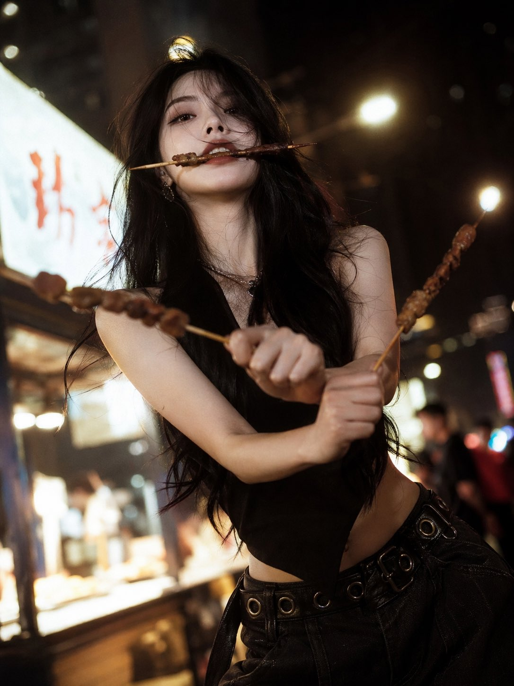

- **Author:** [BubbleBrain](https://x.com/BubbleBrain)
- **Source:** [X](https://x.com/BubbleBrain/status/2046564674112831920)
- **Published:** April 21, 2026
- **Languages:** en

<details>
<summary>Copy Prompt</summary>

```text
a stunning beauty with a cool, aloof atmosphere, delicate facial features, a cold and sophisticated high-fashion face, long hair, and a graceful slender figure; barbecue “three-sword style” pose: one barbecue skewer held in her mouth, one skewer in each hand crossed to mimic Zoro’s three-sword style; street night scene ambiance, warm yellow night market lighting, blurred background, film-like texture, soft-focus glow, cinematic storytelling feel, trendy high-end influencer-style fashion shoot, clear luminous skin, sharply detailed strands of hair, lively dynamic expression, low-angle wide-angle shot, moody dark-toned atmosphere, shallow depth of field, ultra HD 8K, extreme detail, cinematic lighting
```

</details>

---

### #9 Black Myth Pan Jinlian Game Screen

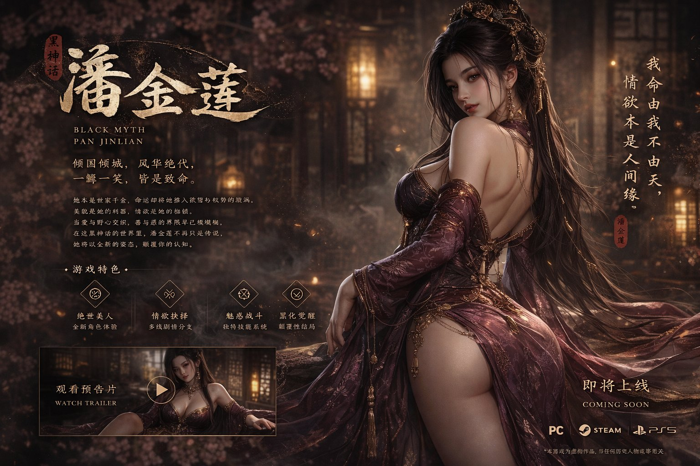

- **Author:** [李岳](https://x.com/liyue_ai)
- **Source:** [X](https://x.com/liyue_ai/status/2046576160952443082)
- **Published:** April 21, 2026
- **Languages:** zh

<details>
<summary>Copy Prompt</summary>

```text
生成一张黑神话·潘金莲的游戏介绍画面，人物十分的迷人
```

</details>

---

### #10 Data Science Machine Learning Landscape Infographic

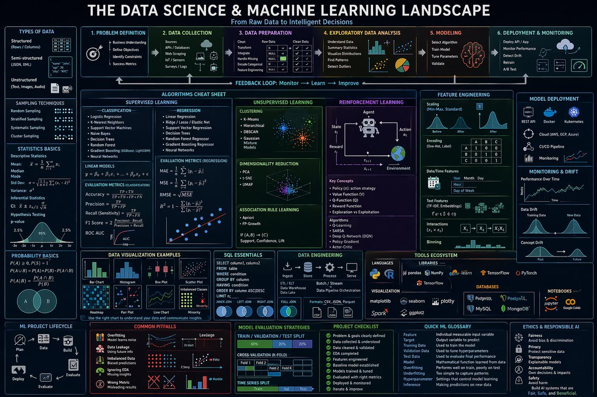

- **Author:** [Echora Continuum](https://x.com/EchoraContinuum)
- **Source:** [X](https://x.com/EchoraContinuum/status/2046517163826246133)
- **Published:** April 21, 2026
- **Languages:** en

<details>
<summary>Copy Prompt</summary>

```text
Generate somthing super complex and info dense…
```

</details>

---

### #11 Demenigis Anatomy Color Guide

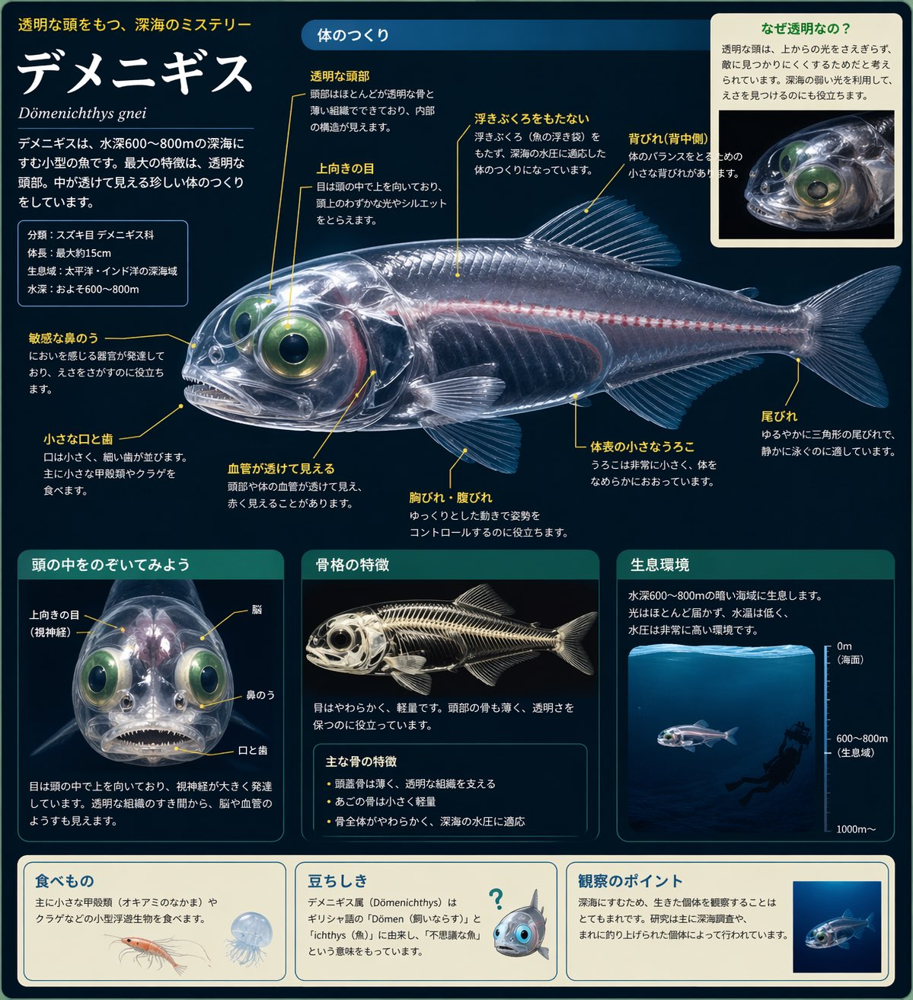

- **Author:** [IT navi](https://x.com/itnavi2022)
- **Source:** [X](https://x.com/itnavi2022/status/2046500429786402973)
- **Published:** April 21, 2026
- **Languages:** ja

<details>
<summary>Copy Prompt</summary>

```text
デメニギスの体の構造を解説するカラー図鑑のページ
```

</details>

---

### #12 Early Heisei Shibuya Center Gai Street

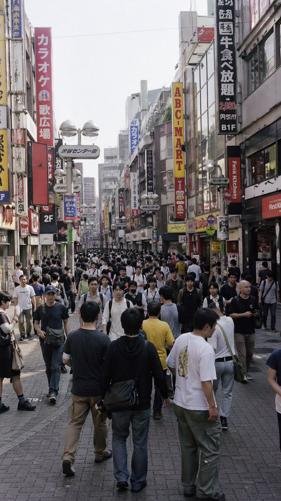

- **Author:** [のるま](https://x.com/noruma_noel)
- **Source:** [X](https://x.com/noruma_noel/status/2046564620895494283)
- **Published:** April 21, 2026
- **Languages:** ja

<details>
<summary>Copy Prompt</summary>

```text
平成初期の渋谷センター街を当時の撮影機材で撮影。
```

</details>

---

### #13 Fuji Couple Almost Kiss Portrait

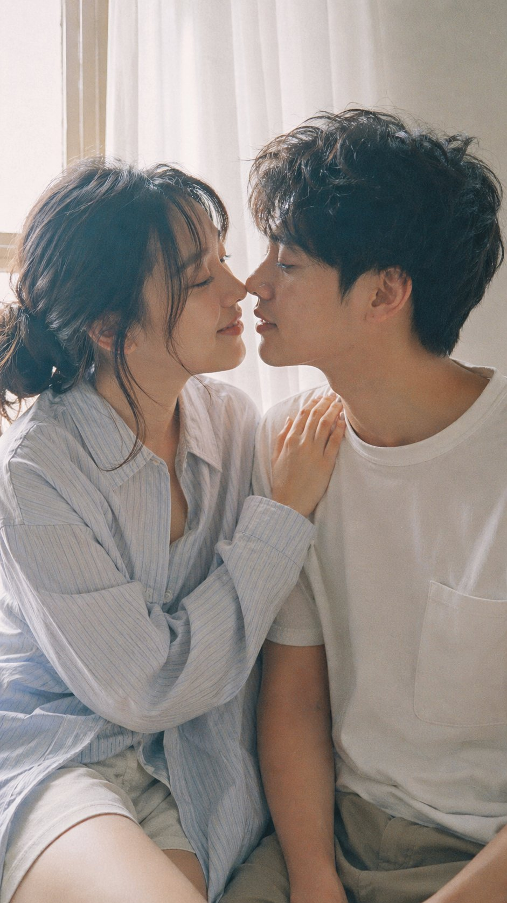

- **Author:** [BubbleBrain](https://x.com/BubbleBrain)
- **Source:** [X](https://x.com/BubbleBrain/status/2046502288102170757)
- **Published:** April 21, 2026
- **Languages:** en

<details>
<summary>Copy Prompt</summary>

```text
9:16 vertical — Japanese Fuji film style couple portrait, two subjects
Fujifilm analog aesthetic (Pro 400H / Superia feel), soft pastel tones, slight green-magenta shift, low contrast, gentle highlight roll-off, fine film grain, subtle halation
bright natural daylight, diffused sunlight through window, soft shadows, airy atmosphere
young Japanese couple, natural minimal makeup, realistic skin texture, slight imperfections
female outfit: oversized button-up shirt with loose shorts, relaxed fit, soft casual styling
male outfit: simple t-shirt or light shirt, clean and understated
hair: natural, slightly tousled for both
pose: close intimate distance — sitting or standing close together; the girl gently leaning toward him, one hand lightly resting on his shoulder or chest; the boy slightly leaning in, faces close, almost touching, capturing the moment just before a kiss
expression: soft smiles or gentle gaze toward each other, relaxed and natural, emotional connection visible
camera: close framing (waist-up), eye-level, intimate distance, slight handheld feel
setting: minimal indoor near window, light curtains, clean soft background
lighting: diffused daylight, gentle highlight bloom, soft shadow transitions
mood: warm, romantic, intimate everyday moment, natural affection
quality: ultra-realistic, analog film look, fine grain, slight softness, natural imperfections
```

</details>

---

### #14 Fuji Strawberry School Uniform Portrait

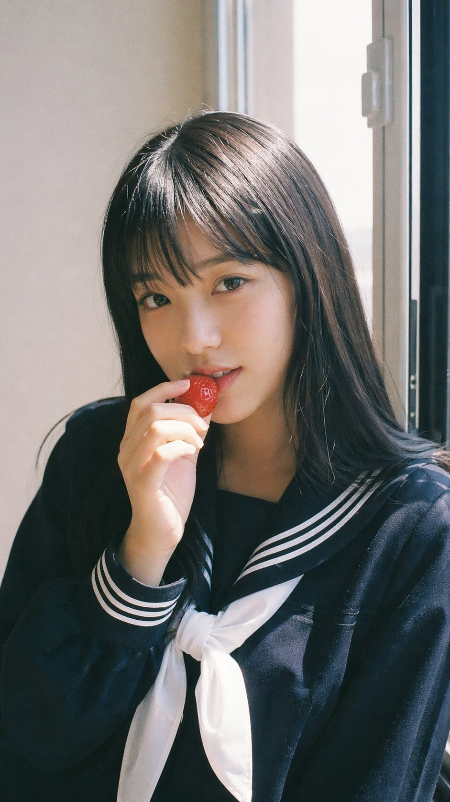

- **Author:** [BubbleBrain](https://x.com/BubbleBrain)
- **Source:** [X](https://x.com/BubbleBrain/status/2046483268019884384)
- **Published:** April 21, 2026
- **Languages:** en

<details>
<summary>Copy Prompt</summary>

```text
9:16 vertical — Japanese Fuji film style portrait, single subject
Fujifilm analog aesthetic (Pro 400H / Superia feel), soft pastel tones, slight green-magenta shift, low contrast, gentle highlight roll-off, fine film grain, subtle halation, slight vignette
bright natural daylight, diffused sunlight through window, soft shadows, airy atmosphere
young Japanese female idol, natural minimal makeup, fresh glowing skin, realistic texture, slight imperfections
outfit: Japanese school uniform (sailor-style or blazer uniform), neatly styled, non-revealing, youthful and clean
hair: natural dark hair, straight or softly flowing, a few loose strands
pose: front-facing or slight angle toward camera, relaxed posture; one hand gently holding a strawberry near lips, mid-action as if about to take a bite; shoulders relaxed, subtle natural body curve
expression: soft playful gaze, light smile or neutral lips, gentle eye contact with camera
setting: minimal indoor near window or simple outdoor corner, clean background, everyday atmosphere
composition: slightly off-center framing, intimate distance, candid feel
mood: fresh, youthful, sweet everyday moment, understated charm
quality: ultra-realistic, analog film look, natural imperfections, soft dreamy finish
```

</details>

---

### #15 Gpt Image2 Revolution Game Promo

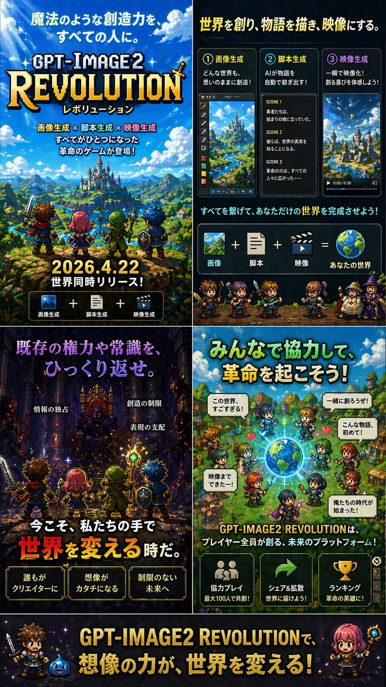

- **Author:** [ぽんず | AI映像](https://x.com/ponzponz15)
- **Source:** [X](https://x.com/ponzponz15/status/2046561719204638946)
- **Published:** April 21, 2026
- **Languages:** ja

<details>
<summary>Copy Prompt</summary>

```text
いや、ちゃうね。ほんまにドラクエっぽくしたら良くないのと、すごろくっぽくしてデザインとしてはいいんやけど、これはあくまでGPTイメージ2っていうゲームを架空で、これからみんなで世界を変えていこうと。魔法のような画像生成能力、脚本能力、そしてそれを映像にする能力を私たちはみんな手に入れることになるんです。そしてこれからそれによって革命を起こしていくんだと。既存の権力や能力をひっくり返せなかったであろうところに、私たちがみんなで協力して進んでいくんだ。そういう意味のGPTイメージ2のレボリューションっていう名前のゲームにしてください。
```

</details>

---

### #16 Juliana Tokyo Bubble Era Dance Floor

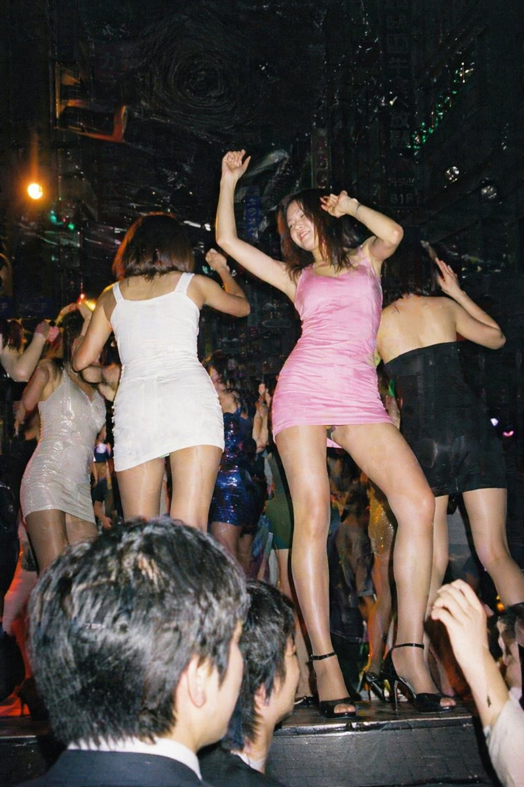

- **Author:** [のるま](https://x.com/noruma_noel)
- **Source:** [X](https://x.com/noruma_noel/status/2046564620895494283)
- **Published:** April 21, 2026
- **Languages:** ja

<details>
<summary>Copy Prompt</summary>

```text
平成バブル期のジュリアナ東京で踊る女性達をお立ち台下から当時の機材で素人が撮影。
```

</details>

---

### #17 Morning Fuji Homewear Portrait

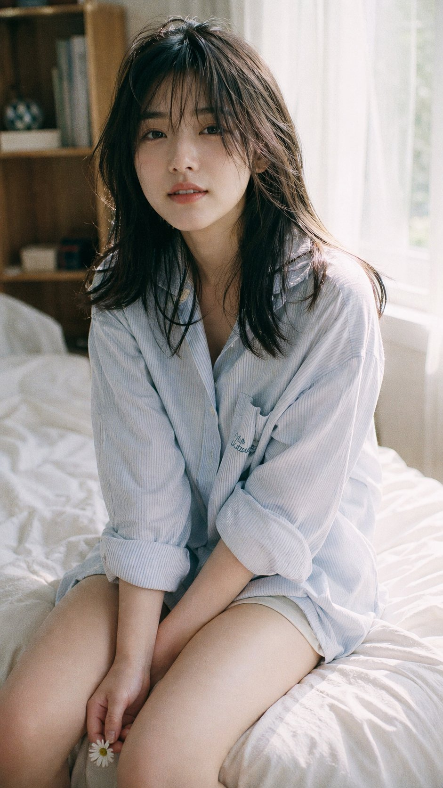

- **Author:** [BubbleBrain](https://x.com/BubbleBrain)
- **Source:** [X](https://x.com/BubbleBrain/status/2046661936381911182)
- **Published:** April 21, 2026
- **Languages:** en

<details>
<summary>Copy Prompt</summary>

```text
9:16 vertical — Japanese Fuji film style portrait, single subject
Fujifilm analog aesthetic (Pro 400H / Superia feel), soft pastel tones, slight green-magenta shift, low contrast, gentle highlight roll-off, fine film grain, subtle halation
early morning indoor setting near window, soft curtains, fresh daylight
young Japanese female idol, natural minimal makeup, soft fresh skin texture
outfit: oversized shirt with loose shorts, relaxed homewear style, non-revealing
hair: slightly messy, natural volume, just-woke-up feeling
pose: sitting on bed edge or by window, body slightly leaning forward, shoulders relaxed; one hand loosely holding a small flower or fabric, the other resting naturally
expression: soft, slightly sleepy gaze, calm and natural
lighting: soft morning light, diffused, gentle shadows
mood: quiet, fresh, intimate everyday moment
quality: ultra-realistic, film grain, slight softness, natural imperfections
```

</details>

---

### #18 Sam Altman Riding Bear Selfie


- **Author:** [Justin](https://x.com/JustinGorya)
- **Source:** [X](https://x.com/JustinGorya/status/2046510831832006970)
- **Published:** April 21, 2026
- **Languages:** en

<details>
<summary>Copy Prompt</summary>

```text
generate image: Selfie of Sam Altman riding a bear
```

</details>

---

### #19 Sam Altman Riding Bear Transparent Cutout

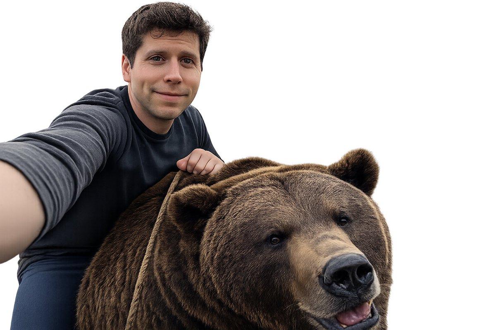

- **Author:** [Justin](https://x.com/JustinGorya)
- **Source:** [X](https://x.com/JustinGorya/status/2046510831832006970)
- **Published:** April 21, 2026
- **Languages:** en

<details>
<summary>Copy Prompt</summary>

```text
Remove the background make it transparent
```

</details>

---

### #20 Science Fiction Movie Poster Echoes


- **Author:** [underwood](https://x.com/underwoodxie96)
- **Source:** [X](https://x.com/underwoodxie96/status/2046514205529088501)
- **Published:** April 21, 2026
- **Languages:** en

<details>
<summary>Copy Prompt</summary>

```text
Create a Science fiction movie poster
```

</details>

---

### #21 Soft Black Mist Floor Portrait

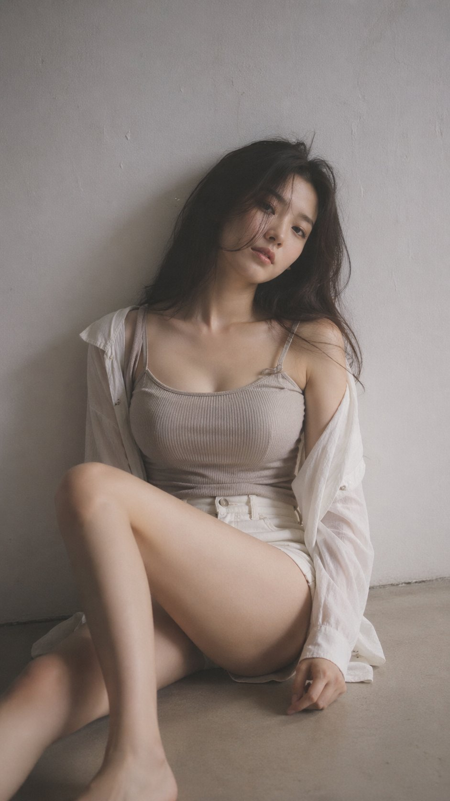

- **Author:** [BubbleBrain](https://x.com/BubbleBrain)
- **Source:** [X](https://x.com/BubbleBrain/status/2046434670724907395)
- **Published:** April 21, 2026
- **Languages:** en

<details>
<summary>Copy Prompt</summary>

```text
9:16 vertical — editorial portrait, single subject
soft black mist filter, subtle haze, gentle highlight bloom, muted tones
minimal indoor space, clean background, slight texture
young Korean woman, minimal makeup, natural skin texture
outfit: fitted ribbed knit top or soft camisole layered under a loose shirt, paired with high-waisted shorts or skirt; fabric slightly clings to body shape, soft and natural, no revealing elements
hair: slightly messy, natural volume
pose: sitting on floor with one leg bent and the other relaxed, body slightly leaning, shoulders not aligned, head tilted
composition: subject slightly off-center, negative space present
expression: calm, slightly distant, natural lips
lighting: soft side light, gentle shadow falloff
mood: understated, quiet, subtly sensual through natural body lines, relaxed and unposed
quality: fine grain, slight softness, realistic look
```

</details>

---

### #22 Soft Black Mist Korean Idol Portrait

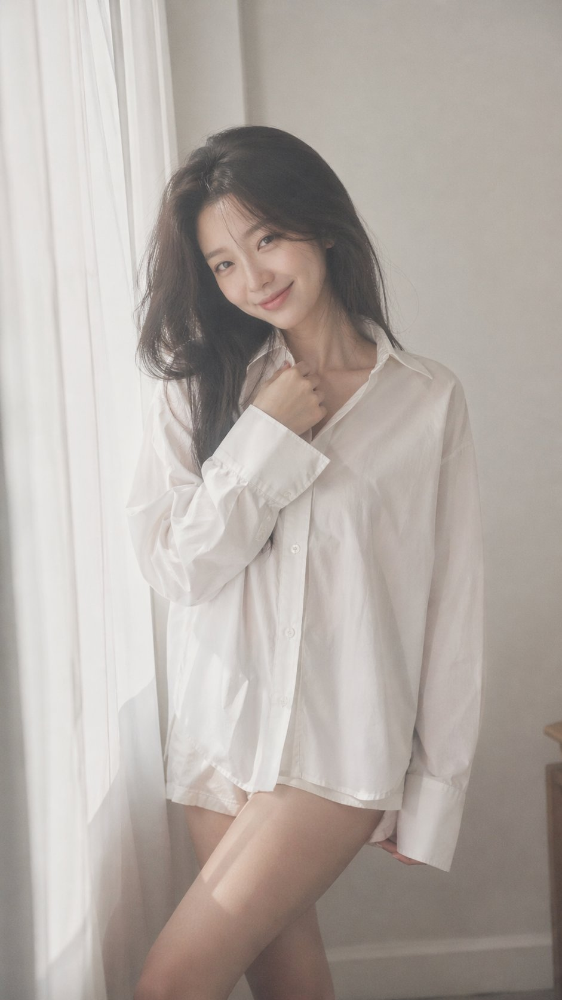

- **Author:** [BubbleBrain](https://x.com/BubbleBrain)
- **Source:** [X](https://x.com/BubbleBrain/status/2046518189509734903)
- **Published:** April 21, 2026
- **Languages:** en

<details>
<summary>Copy Prompt</summary>

```text
9:16 vertical — Korean idol portrait photography, single subject
soft black mist filter effect, lowered contrast, gentle highlight bloom, subtle glow, soft diffusion, slightly faded blacks
minimal indoor setting near window, white curtains, clean light-toned background
young Korean female idol, natural minimal makeup, dewy realistic skin texture, subtle imperfections
outfit: oversized white button-up shirt + short bottoms, slightly loose fit, soft and casual styling, no revealing elements
hair: long dark hair, slightly messy, natural volume, softly flowing
pose: relaxed standing or slight lean, body subtly angled, one leg slightly forward, shoulders relaxed; one hand lightly touching collar or resting near neckline, the other relaxed; gentle body curve without exaggeration
expression: soft cute smile, slightly playful eyes, direct or slightly off-camera gaze
camera: close to mid-body framing, eye-level, intimate distance, slight handheld feel
lighting: diffused natural daylight, soft shadows, gentle light wrapping around face and body
mood: cute yet subtly sensual, intimate, everyday softness, quiet romantic atmosphere
quality: ultra-realistic, fine film grain, slight softness at edges, natural imperfections, dreamy understated tone
```

</details>

---

### #23 Soten No Hekireki Anime Movie Poster

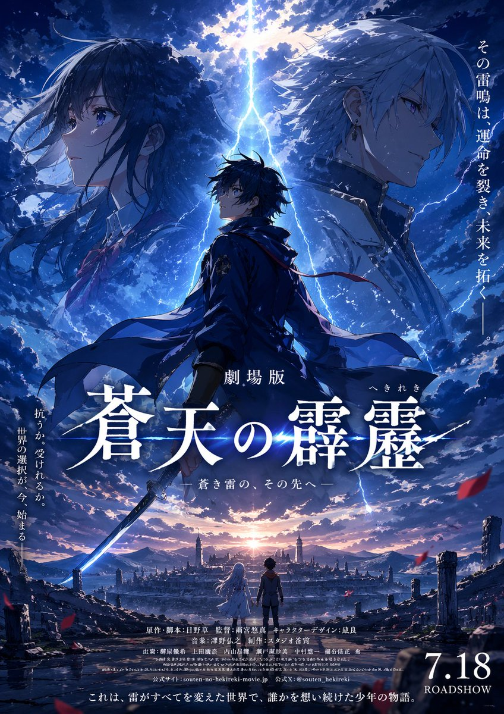

- **Author:** [Toshi@ニャルオAI](https://x.com/Toshi_nyaruo_AI)
- **Source:** [X](https://x.com/Toshi_nyaruo_AI/status/2046565932101964009)
- **Published:** April 21, 2026
- **Languages:** ja

<details>
<summary>Copy Prompt</summary>

```text
「蒼天の霹靂」という架空アニメの劇場版ポスターを作って
```

</details>

---

### #24 Ccd Caught Off Guard Homewear Portrait

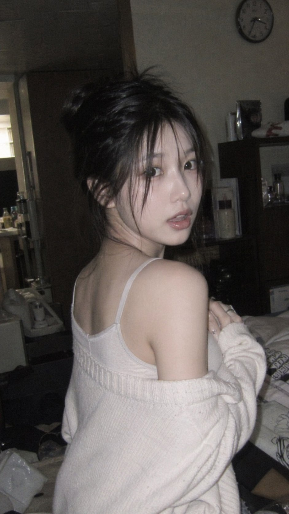

- **Author:** [BubbleBrain](https://x.com/BubbleBrain)
- **Source:** [X](https://x.com/BubbleBrain/status/2046190539213885806)
- **Published:** April 20, 2026
- **Languages:** en

<details>
<summary>Copy Prompt</summary>

```text
{
  "prompt": {
    "style_and_tech": "mobile phone photo, old CCD camera aesthetic, harsh flash, grainy, dim messy indoor lighting, candid snapshot feeling, slight motion blur",
    "subject": "young Korean female idol, soft innocent look",
    "pose": "mid-action, slightly turning head toward camera as if just noticed being photographed, shoulders slightly raised",
    "expression": "eyes widened slightly, lips parted in surprise, shy and caught-off-guard expression",
    "clothing": "loose soft homewear (thin cardigan + inner top), slightly slipping off one shoulder but not revealing",
    "vibe": "unprepared, intimate, accidental moment, evokes curiosity and protectiveness"，
    "aspect ratio": "9:16"
  }
}
```

</details>

---

### #25 Korean Idol 3X3 Grid Collage Portrait

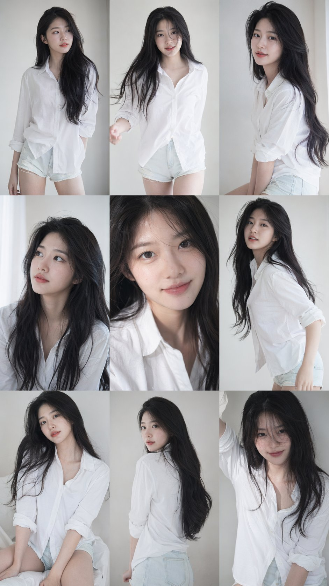

- **Author:** [BubbleBrain](https://x.com/BubbleBrain)
- **Source:** [X](https://x.com/BubbleBrain/status/2046151898621993364)
- **Published:** April 20, 2026
- **Languages:** en

<details>
<summary>Copy Prompt</summary>

```text
9:16 vertical — a 3x3 grid collage (nine images) forming a Korean idol portrait photoshoot series. Each frame features the same young Korean female idol, maintaining 100% consistency in facial features, proportions, hairstyle, and identity across all nine shots.
Natural, ultra-realistic skin texture, no retouching, no smoothing. Clean idol-style minimal makeup, soft glow, subtle imperfections.
Hair: long, voluminous dark hair, slightly tousled, consistent across all frames (natural loose flow, slight movement).
Outfit: cohesive Korean idol photoshoot styling — white shirt + short bottoms (or simple neutral-toned outfit), youthful, clean, slightly casual but styled. Same outfit across all frames.
Setting: minimal studio or simple indoor environment (plain wall, soft window light, clean background). Focus on subject, not environment.
Lighting: soft diffused natural light, gentle highlights, low contrast, slightly airy tones, subtle film-like softness.
Camera style: intimate portrait photography, slightly handheld feel, subtle imperfections (minor grain, slight blur in motion frames, imperfect framing).
Frame breakdown (3x3 grid):
Top row: - Top left: standing naturally, looking slightly away, relaxed expression - Top center: facing camera, casual mid-motion (hair or body slight movement) - Top right: slight side angle, soft gaze, natural candid feel
Middle row: - Center left: looking slightly upward, soft thoughtful expression - Center: close-up portrait, direct eye contact, gentle idol smile - Center right: turning body slightly, mid-motion candid frame
Bottom row: - Bottom left: seated or leaning casually, relaxed posture - Bottom center: back partially turned, looking over shoulder toward camera - Bottom right: standing close to frame, slightly playful or soft expression
Mood: Korean idol photobook / photocard aesthetic, intimate, soft, natural, everyday charm.
Quality: ultra-realistic, 8K detail, subtle analog film grain, natural imperfections, soft dreamy tone
```

</details>

---

### #26 Soft Airy 35Mm Portrait

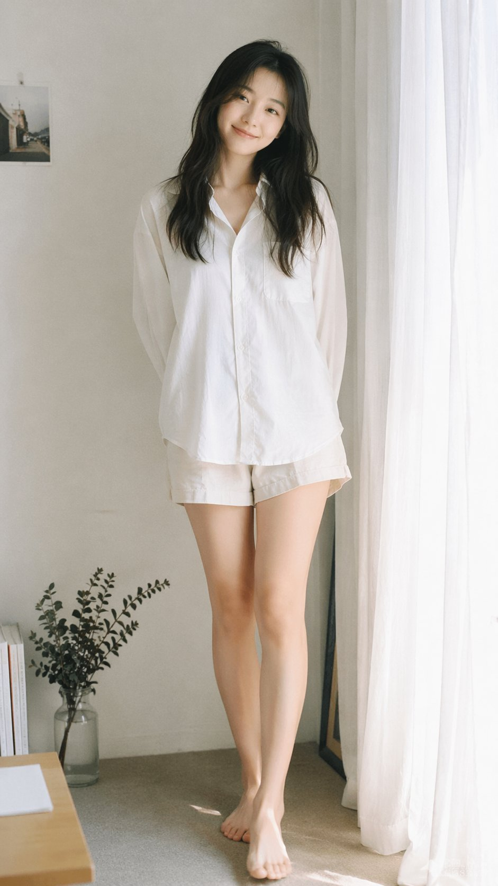

- **Author:** [BubbleBrain](https://x.com/BubbleBrain)
- **Source:** [X](https://x.com/BubbleBrain/status/2046115431144902732)
- **Published:** April 20, 2026
- **Languages:** en

<details>
<summary>Copy Prompt</summary>

```text
Analog 35mm film photography, soft airy Japanese-style aesthetic, gentle diffused natural window light, slight overexposure, pastel tones, low contrast, soft highlights, minimal indoor setting near a window with white curtains, clean light-colored wall, natural composition, eye-level, slightly closer full-body framing (mid-thigh to head), young East Asian woman, natural minimal makeup, soft realistic skin texture, long slightly messy dark hair, oversized white button-up shirt, light casual shorts, barefoot, simple and relaxed styling, standing naturally with relaxed posture, arms loosely at sides or slightly behind, facing camera, gentle soft smile, subtle stillness, focus on light, air, and quiet everyday mood, soft film grain, dreamy and understated atmosphere --ar 9:16
```

</details>

---

### #27 Soft Black Mist Korean Idol 3X3 Collage

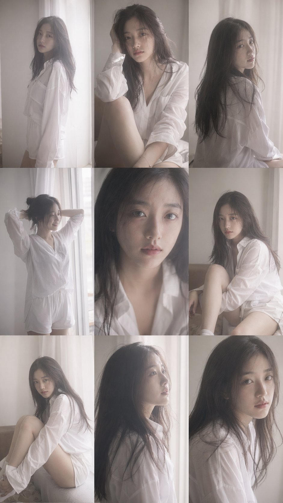

- **Author:** [BubbleBrain](https://x.com/BubbleBrain)
- **Source:** [X](https://x.com/BubbleBrain/status/2046268941941850575)
- **Published:** April 20, 2026
- **Languages:** en

<details>
<summary>Copy Prompt</summary>

```text
9:16 vertical — Korean idol portrait photoshoot, 3x3 grid (nine frames), same person in all images, consistent facial features and styling.
soft black mist filter effect, lowered contrast, blooming highlights, subtle glow around light sources, slightly faded blacks
natural indoor setting near window, white curtains, clean wall background
young Korean female idol, minimal makeup, soft realistic skin texture, slight imperfections
outfit: white shirt + shorts, simple and relaxed styling
hair: long dark hair, slightly messy, naturally flowing
poses vary across nine frames: standing, slight movement, seated, looking away, close-up, over-shoulder glance, candid transitions
lighting: diffused daylight, soft shadows, gentle highlight bloom
mood: quiet, intimate, everyday poetic moment, photobook aesthetic
quality: ultra-realistic, subtle film grain, soft focus edges, dreamy atmosphere
```

</details>

---

### #28 Guangzhou City Impression Swallow Poster

| View 1 | View 2 |
| --- | --- |
| 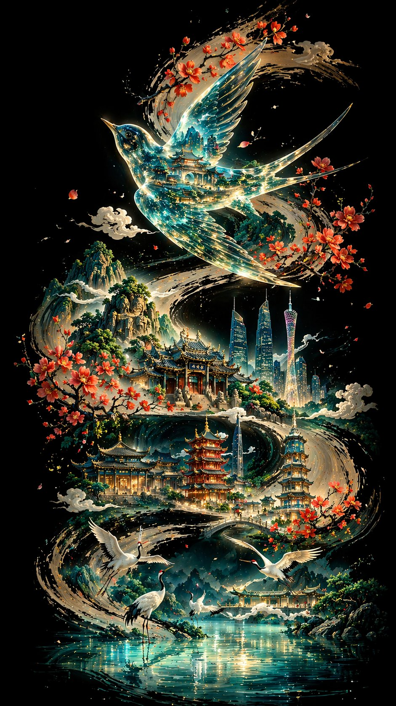 | 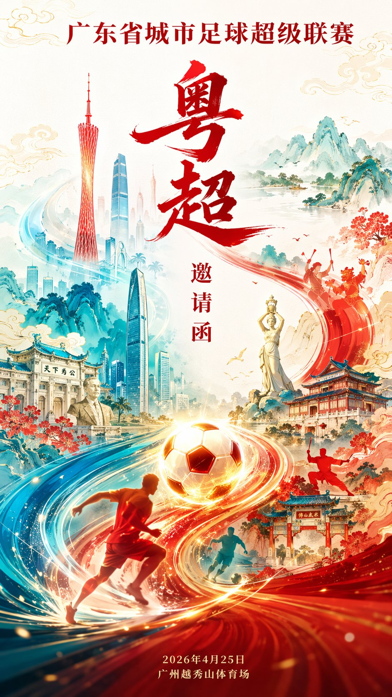 |

- **Author:** [李岳](https://x.com/liyue_ai)
- **Source:** [X](https://x.com/liyue_ai/status/2045873940883808523)
- **Published:** April 19, 2026
- **Languages:** zh

<details>
<summary>Copy Prompt</summary>

```text
【背景与骨架线条】
纯黑深邃底色，一条粗壮有力的墨色书法S型曲线自画面一端蜿蜒贯穿至另一端，笔触苍劲，墨迹浓淡有致，如大写意行笔，构成整幅画面的视觉骨架与叙事动线。
【主体：透明燕子】
曲线上方，一只展翅飞翔的画眉鸟占据视觉核心；身体呈玻璃透明质感，内部映射传统建筑群叠影，蓝绿色光流在透明羽翼间流转折射，仿佛时间长河与文明记忆凝缩其中；轮廓以极细金线勾边，增强立体感与神圣感。
【中景：古典建筑序列】
燕子下方，沿墨线曲线错落分布广州的各种风景名胜：白云山、陈家祠、双子塔、广州塔、猎德大桥、海珠塔依次浮现；主色调青绿与淡金，建筑细节清晰，琉璃瓦、飞檐翘角、石阶回廊；木棉花簇拥点缀于建筑周围，花瓣随风轻散，静谧而悠远；几朵水墨云朵轻盈飘浮其间，增添空灵层次。
【前景：白鹤与水面】
前景湖畔：数只白鹤或静立水边、或振翅腾飞，姿态各异，优雅从容；浅蓝湖面如镜，倒影荡漾，波光细碎，营造宁静氛围。
【远景：山峦】
远处山峦层叠起伏，青黛色晕染，墨色由浓至淡，朦胧氤氲，富有水墨层次；与前景形成近实远虚的空间纵深。
【构图与光影】
非线性透视构图，墨线曲线为叙事主轴，古今元素沿线嵌入；光源自画面中心向外辐射扩散，形成强烈明暗对比，中心亮、四周渐暗；冷色调主导（深蓝、青绿、银白），暖色点缀（樱花粉、淡金），和谐而神秘；东方美学与现代意象交融，超现实诗意意境。
【技术规格】
8K超高清渲染，极致细节精度，最佳画质，比例 9:16
```

</details>

---

### #29 Sam Altman Skatepark Snapshot


- **Author:** [Ilbs (I love boring stuff)](https://x.com/Malek1173989)
- **Source:** [X](https://x.com/Malek1173989/status/2045836887684694395)
- **Published:** April 19, 2026
- **Languages:** en

<details>
<summary>Copy Prompt</summary>

```text
"Sam Altman on a skateboard at a skatepark with no people."
```

</details>

---

### #30 Surreal Koi Nebula Illustration

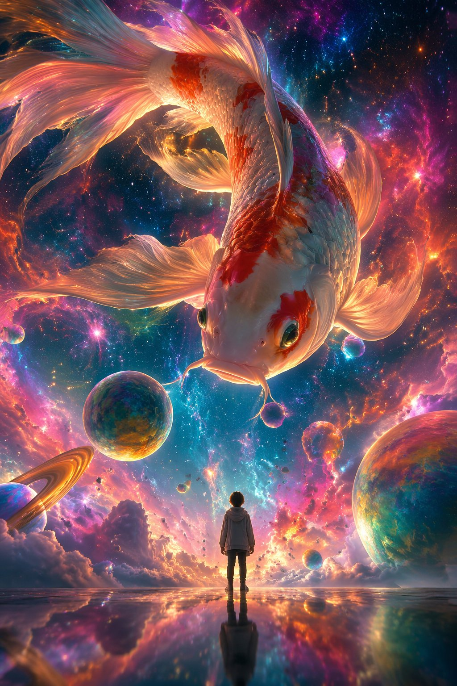

- **Author:** [李岳](https://x.com/liyue_ai)
- **Source:** [X](https://x.com/liyue_ai/status/2045875219307655337)
- **Published:** April 19, 2026
- **Languages:** zh

<details>
<summary>Copy Prompt</summary>

```text
一幅超现实主义数字插画风格，采用低角度仰拍视角。画面描绘了一条巨型彩色锦鲤遨游在梦幻般的星云中，四周环绕着色彩鲜艳的星云与气泡。画面中央还站着一个小人，背对观众，神情平静地仰望空中这条巨大的锦鲤，锦鲤头向下看着小人。整体画面呈现出强烈的大小对比，氛围空灵又梦幻。比例9:16
```

</details>

---

### #31 Boston Spring 2026 City Poster


- **Author:** [BubbleBrain](https://x.com/BubbleBrain)
- **Source:** [X](https://x.com/BubbleBrain/status/2045358053831172358)
- **Published:** April 18, 2026
- **Languages:** en

<details>
<summary>Copy Prompt</summary>

```text
A striking Spring 2026 city poster for Boston with an elegant celebratory mood and a bold contemporary design. On a clean off-white textured background with large areas of negative space, a miniature single sculler rows across the lower right corner of the image on a narrow ribbon of reflective water. The wake from the oar sweeps upward in a dynamic calligraphic curve, gradually transforming into the Charles River and then into a dreamlike hand-painted panorama of Boston. Inside this flowing river-shaped composition are iconic Boston elements: the Back Bay skyline, Beacon Hill brownstones, Acorn Street, Boston Public Garden, Swan Boats, Zakim Bridge, Fenway-inspired details, historic brick architecture, harbor ferries, and the city’s waterfront atmosphere. Soft morning fog, golden spring light, subtle festive accents in crimson and gold, rich detail, layered depth, sophisticated city-poster aesthetics, fresh and refined, visually powerful but not overcrowded. Elegant typography in the lower left reads “SPRING 2026” with a vertical slogan “BOSTON, A CITY OF RIVER, MEMORY, AND INVENTION”, text clear and beautifully composed, premium graphic design, 9:16
```

</details>

---

### #32 Chengdu Food Map Illustration


- **Author:** [终极小谢](https://x.com/Panda20230902)
- **Source:** [X](https://x.com/Panda20230902/status/2045396918965285111)
- **Published:** April 18, 2026
- **Languages:** zh

<details>
<summary>Copy Prompt</summary>

```text
一张手绘风格的城市美食地图，以成都为主题。画面以鸟瞰视角的手绘简化城市地图为底，标注主要道路和地标但不追求精确比例而是追求可爱的手绘感。地图上分布着 12 个美食地点的精致手绘小插画：春熙路的串串香（一把竹签插着各种食材冒着热气）、宽窄巷子的三大炮（三个糯米团子飞向铜盘）、建设路的蛋烘糕（金黄酥脆正在翻面）、玉林路的火锅（九宫格锅翻滚冒泡）等，每个插画约占地图的 5% 面积，旁边用手写体标注店名和一句推荐语"凌晨两点还在排队的那家"。地图边缘用手绘藤蔓和辣椒装饰形成边框。右下角有一个手绘指南针和图例说明。左上角标题"成都·吃货暴走地图"使用胖圆的手绘美术字配辣椒装饰。整体画风为水彩+彩铅混合的手绘质感，颜色以暖色系（辣椒红、姜黄、翠绿）为主，图片比例 1:1。
```

</details>

---

### #33 Chinese Minimalist S Shaped Poster

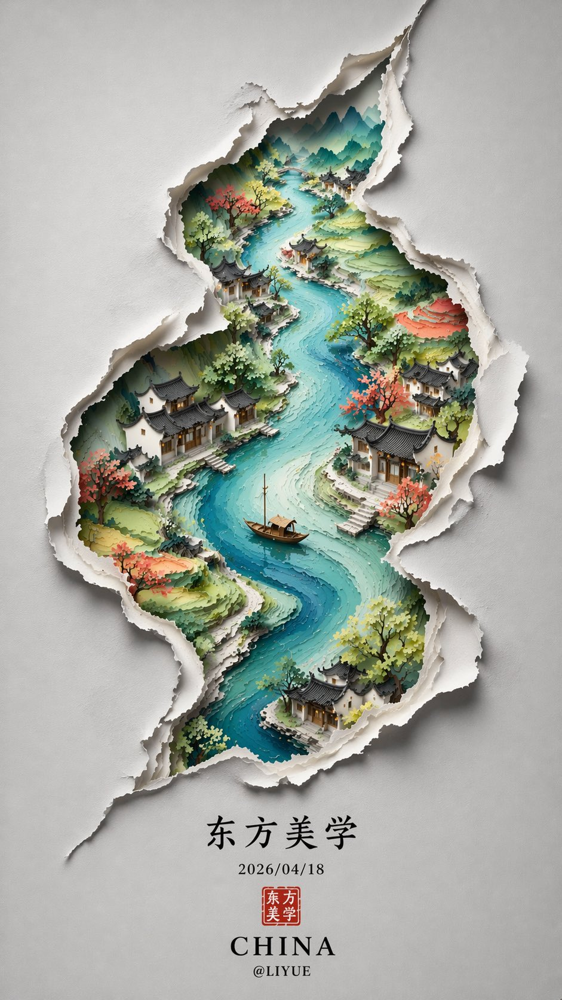

- **Author:** [李岳](https://x.com/liyue_ai)
- **Source:** [X](https://x.com/liyue_ai/status/2045368305079447853)
- **Published:** April 18, 2026
- **Languages:** zh, en

<details>
<summary>Copy Prompt</summary>

```text
极简新中式美学风格，画面以淡雅的灰白色为底，呈现出一种纸艺剪影般的立体感。
一条S形蜿蜒的裂痕状边缘将画面分割，仿佛撕开了一层纸面，露出内部色彩斑斓的东方山水景象。
裂口内，一条蜿蜒的河流自上而下贯穿整个构图，河水以深浅不一的蓝色渲染，层次分明，仿佛流动的丝带。
河岸两侧点缀着青翠的山丘与梯田，色彩柔和，绿红交织，展现出田园的宁静之美。
沿河而建的古风建筑错落有致，飞檐翘角，白墙黛瓦，在光影的映衬下更显古朴典雅。
岸边树木葱茏，枝叶轻盈，一艘小船静泊于水中央，增添了几分悠然意境。
整体构图呈S形曲线，富有韵律感，仿佛自然与人文的和谐共生。
画作边缘采用撕纸效果，营造出立体浮雕般的视觉体验。
下方题字“东方美学”以黑色楷体书写，日期“2026/04/18”与红色印章相呼应，底部“CHINA”字样庄重醒目，署名“@LIYUE”低调收尾，整体氛围静谧深远，充满诗意与哲思。
```

</details>

---

### #34 Guangzhou Dream Return City Poster

| View 1 | View 2 |
| --- | --- |
| 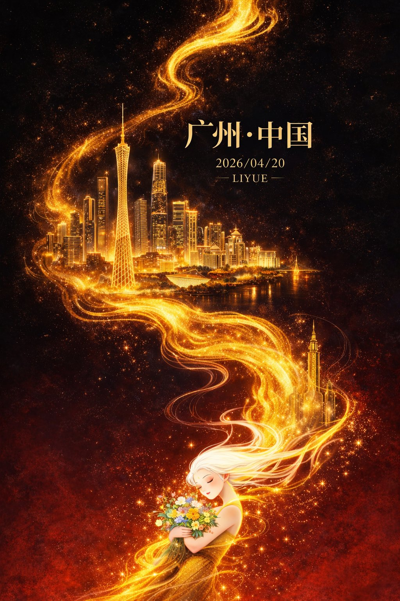 | 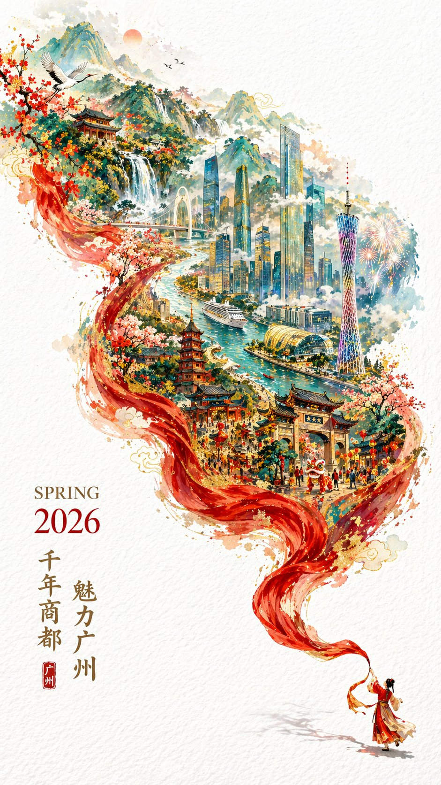 |

- **Author:** [李岳](https://x.com/liyue_ai)
- **Source:** [X](https://x.com/liyue_ai/status/2046243132774494607)
- **Published:** April 18, 2026
- **Languages:** zh, en

<details>
<summary>Copy Prompt</summary>

```text
平面插画，东方幻想风格高端城市海报设计，竖版9:16构图，整体采用对角线+S型流动构图，从左下向右上延展，画面以深邃黑色为背景，自上而下渐变至浓烈暗红色，形成强烈冷暖对比与空间纵深，背景带微弱星尘与颗粒质感。画面中央一条金色流动能量线条如火焰般蜿蜒贯穿，自底部向上延伸，具有流体质感、粒子光效与渐变高光，局部带细微能量碎屑与体积光。

金色流光中逐层浮现广州城市地标建筑群：广州塔为视觉核心，比例突出，周围融合珠江新城高楼群、猎德大桥及现代与岭南建筑元素，建筑采用“精细线描 + 金色发光体块”表现，轮廓清晰、细节丰富，在金色光晕映衬下仿佛悬浮于虚空，形成超现实空间层次，远景轻微雾化增强纵深感。

画面底部为一位东方白发女性形象，长发飘逸，如烟似雾，与金色流光自然衔接并逐渐融合，发丝半透明带渐变光感，姿态柔美，双目微闭，神情宁静，怀抱一束多彩鲜花，花间点缀微光粒子与星点效果，象征人与城市能量的精神连接，人物细节适度简化以突出整体设计感。

光影集中于金色流线、建筑与人物轮廓，形成强烈明暗对比与视觉聚焦，整体氛围宏大、神秘、具有东方神话意境且略带治愈感。色彩以黑与暗红为基底，高亮鎏金为主视觉强调，金色具备丰富明暗层次，辅以小面积高饱和花束色彩点缀，整体高级克制。

页面文字与画面融合排版：顶部居中宋体大字“广州·中国”，下方小字“2026/04/20”，再下方小字“LIYUE”，文字采用淡金色或柔和暖白色，与整体光影统一。高品质细节，电影级光影表现，体积光与粒子细节丰富，画面干净无噪点，超高清8K分辨率，商业级海报质感。
```

</details>

---

### #35 Museum Style Hanfu Breakdown Infographic


- **Author:** [Larus Canus](https://x.com/MrLarus)
- **Source:** [X](https://x.com/MrLarus/status/2045504669401653414)
- **Published:** April 18, 2026
- **Languages:** zh

<details>
<summary>Copy Prompt</summary>

```text
请根据【主题】自动生成一张“博物馆图鉴式中文拆解信息图”。

要求整张图兼具真实写实主视觉、结构拆解、中文标注、材质说明、纹样寓意、色彩含义和核心特征总结。你需要根据【主题】自动判断最合适的主体对象、服饰体系、器物结构、时代风格、关键部件、材质工艺、颜色方案与版式结构，用户无需再提供其他信息。

整体风格应为：国家博物馆展板、历史服饰图鉴、文博专题信息图，而不是普通海报、古风写真、电商详情页或动漫插画。背景采用米白、绢纸白、浅茶色等纸张质感，整体高级、克制、专业、可收藏。

版式固定为：
- 顶部：中文主标题 + 副标题 + 导语
- 左侧：结构拆解区，中文引线标注关键部件，并配局部特写
- 右上：材质 / 工艺 / 质感区，展示真实纹理小样并附说明
- 右中：纹样 / 色彩 / 寓意区，展示主色板、纹样样本和文化解释
- 底部：穿着顺序 / 构成流程图 + 核心特征总结

若主题适合人物展示，则以真实人物全身站姿为中央主体；若更适合器物或单体结构，则改为中心主体拆解图，但整体仍保持完整中文信息图形式。所有文字必须为简体中文，清晰、规整、可读，不要乱码、错字、英文或拼音。重点突出真实结构、材质差异、文化说明与图鉴气质。

避免：海报感、影楼感、电商感、动漫感、cosplay感、乱标注、错结构、糊字、假材质、过度装饰。
```

</details>

---

### #36 Qiongqi Eastern Aesthetics Poster

| View 1 | View 2 |
| --- | --- |
| 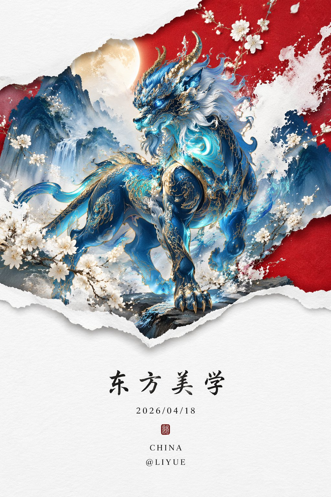 |  |

- **Author:** [李岳](https://x.com/liyue_ai)
- **Source:** [X](https://x.com/liyue_ai/status/2045506567735558336)
- **Published:** April 18, 2026
- **Languages:** zh, en

<details>
<summary>Copy Prompt</summary>

```text
极简主义，新中式风格立体图形设计，图像下端有楷体中国文字：“东方美学”，“2026/04/18”，署名 “CHINA”，和“@LIYUE”；
平整纯白色的亚光质感厚艺术纸上绘充满东方诗意氛围的山水创意画，不规则的撕纸效果；
中国的神兽：穷奇，身形图案完整，美轮美奂，，线条柔美灵动,眼睛炯炯有神，威严的神态，优雅的姿势，奢华装饰艺术，中国传统纹饰；
荧光蓝色线条，0.5mm极细金色金属质感勾边，泼白墨大笔触，色彩渲染，红底，蓝色的浪漫诗意视觉；
冷暖光交织的梦幻唯美场景，强烈的光影对比氛围，花轻舞的时光叙事，东风禅意，画面有大面积留白，框架构图，底部留白，细节清晰。
```

</details>

---

### #37 Song Dynasty Social Media Feed

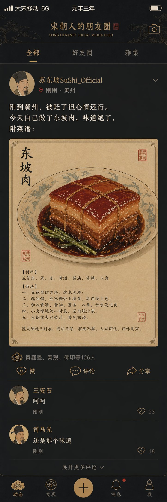

- **Author:** [终极小谢](https://x.com/Panda20230902)
- **Source:** [X](https://x.com/Panda20230902/status/2045385588065313057)
- **Published:** April 18, 2026
- **Languages:** zh, en

<details>
<summary>Copy Prompt</summary>

```text
"宋朝人的朋友圈"/"SONG DYNASTY SOCIAL MEDIA FEED"，古今穿越幽默融合界面设计风格，画面模拟手机社交媒体界面，但内容全部是宋朝场景头像是宋代文人画像，用户名"苏东坡SuShi_Official"，发布内容"刚到黄州，被贬了但心情还行。今天自己做了东坡肉，味道绝了，附菜谱："，配图为工笔画风格的东坡肉特写，点赞列表"黄庭坚、秦观、佛印等126人"，评论区"王安石：呵呵""司马光：还是那个味道"，界面元素如点赞图标用宋代花纹替代，状态栏显示"大宋移动 5G"和"元丰三年"，配色为手机深色模式搭配宋代雅致色调，历史与社交媒体的趣味碰撞杰作
```

</details>

---

### #38 Spring Guangzhou City Poster

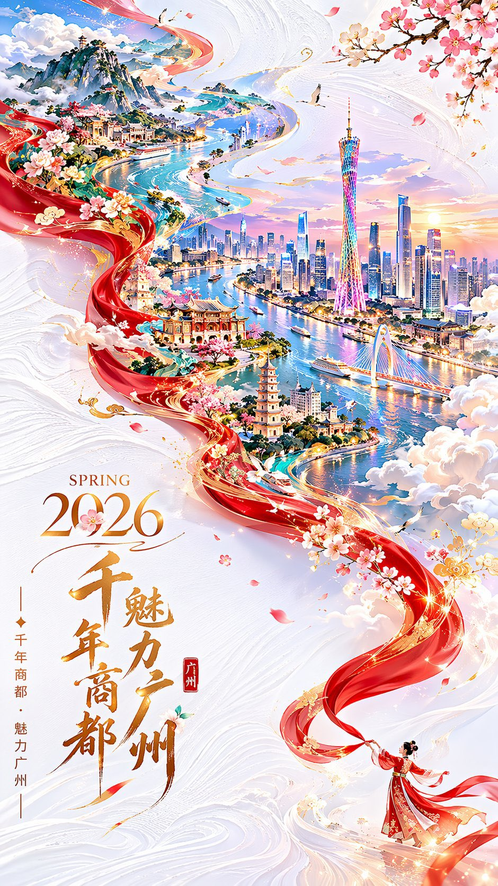

- **Author:** [阿兰AI](https://x.com/alanlovelq)
- **Source:** [X](https://x.com/alanlovelq/status/2045484598487060917)
- **Published:** April 18, 2026
- **Languages:** zh, en

<details>
<summary>Copy Prompt</summary>

```text
一张充满新春喜庆氛围但不失高雅格调的 2026 城市宣传海报。
双重曝光，构图延续了S型的流动感；
在纯白的纹理背景右下角，一个身穿中国传统服饰的微缩人物正在挥舞着一条长长的红色丝绸舞带，这条红绸在空中舞动，不仅展现出丝绸的柔顺质感，更在向左上方飘动的过程中，奇幻地变形成了一条壮丽的山脉河流。
在这条“河流”中，叠加了一个有山有海河的广州城市手绘图，国潮，景色尽在眼底，壮阔雄伟，令人震撼。
广州的地标建筑(广州塔，珠江新城建筑群，珠江, 广州城里古建筑，游轮，白云山）。
云雾环绕，仙气缥缈，色彩丰富，结构复杂，细节丰富，但因为大面积的留白，画面依然显得清新脱俗，左下角排版着“SPRING 2026”和竖排的宣传语，整体寓意“千年商都，魅力广州”。
文字排版优美，大方，字迹清晰完整，尺寸9:16。
```

</details>

---

### #39 35Mm Flash Editorial Portrait


- **Author:** [BubbleBrain](https://x.com/BubbleBrain)
- **Source:** [X](https://x.com/BubbleBrain/status/2045052982728016131)
- **Published:** April 17, 2026
- **Languages:** en

<details>
<summary>Copy Prompt</summary>

```text
35mm color film photography with harsh direct on-camera flash, specular highlights on skin and clothing, strong catchlights in eyes, high contrast flash illumination, authentic film grain and color shift, high fashion fresh innocent basketball court editorial style, intimate first-person low-angle POV shot from below, early 20s sexy Chinese female idol with ultra-realistic delicate refined Chinese features, seductive almond-shaped fox eyes with natural double eyelids, high nose bridge, small sharp V-shaped jawline, flawless realistic porcelain skin with cool ivory undertone and visible flash specular highlights, fine delicate skin texture with subtle pores micro details and natural dewy glow under flash, fresh natural sporty makeup with soft dewy glow, subtle natural flush on cheeks, natural pink lips slightly parted, subtle natural freckles across nose and cheeks, long dark brown hair tied in a high playful ponytail with some loose strands framing the face and realistic loose strands, wearing a loose white tank top and white high-waisted basketball shorts, white knee-high sports socks, seductive natural leaning pose against the basketball hoop pole on the outdoor court at dusk, body angled sideways with naturally arched back and hips gently pushed back to accentuate perky round hips and sexy butt curve, one leg naturally extended forward toward the camera and the other leg slightly bent to emphasize long sexy legs, both hands lightly resting on the basketball pole at shoulder height, intensely seductive playful yet pitiable doe-eyed gaze straight at the viewer with soft vulnerable longing eyes and a gentle teasing smile full of quiet temptation and desire, harsh direct on-camera flash creating sharp specular highlights and strong catchlights, background with blurred basketball court and hoop under dusk sky, high contrast film color grading with natural flash look, extremely sharp yet soft skin rendering with authentic 35mm direct flash aesthetic, natural hair strands, realistic fabric texture on tank top and shorts with socks detail, no plastic skin, no digital over-sharpening, no airbrushing, no blemishes, no moles, no oily skin, no watermark, no text, authentic 35mm direct flash film basketball court look --ar 9:16
```

</details>

---

### #40 916 Cosplayer Portrait Screenshot

| View 1 | View 2 |
| --- | --- |
|  | 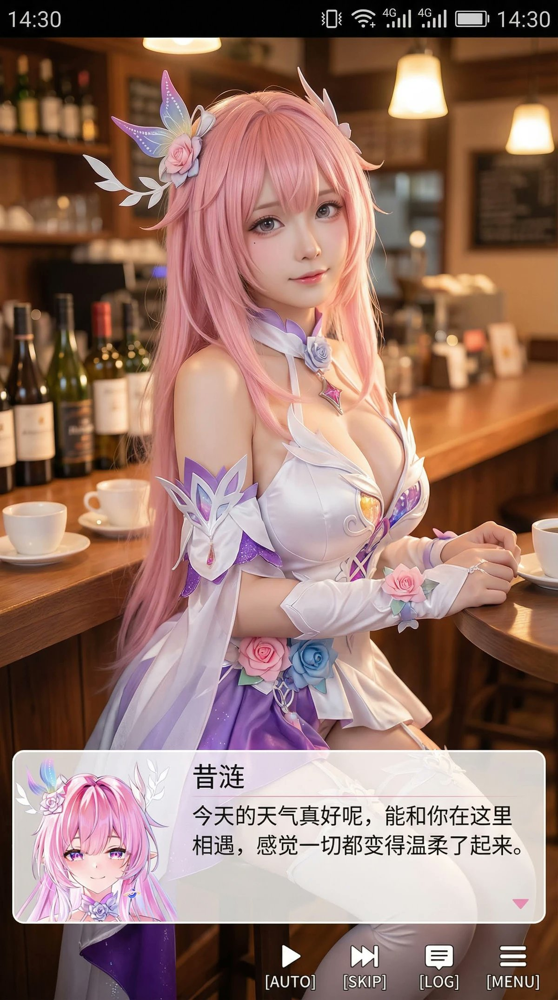 |

- **Author:** [AGI伸伸哥](https://x.com/Zoulinshen)
- **Source:** [X](https://x.com/Zoulinshen/status/2045082518089810073)
- **Published:** April 17, 2026
- **Languages:** zh, en

<details>
<summary>Copy Prompt</summary>

```text
生成一张竖版手机截图风格的图片，整体比例接近 9:16。画面中心偏上是一位真人 coser，扮演（角色名称）的二次元角色。人物为写实风格，但五官略带动漫感，皮肤细腻，眼睛稍大，表情温柔地看向镜头，坐在室内的休闲场景中，例如咖啡厅或酒吧吧台前，背景有符合场景的道具。画面最上方加入手机系统状态栏 UI，包括时间、电量、信号、网络等图标，让整张图看起来像手机截图。画面底部叠加一块宽大的半透明 galgame 风格对话框，对话框左侧放一个与画面人物对应的动漫或 Q 版头像；对话框右侧排版文字：第一行用较大字体显示与前面相同的角色名字，下面一到两行显示一段适合这个角色人设的、温柔治愈风格的简体中文台词，由你自动创作。再在对话框下方加一条操作栏，仿照 galgame UI。整体风格高清、细节丰富、光线柔和、二次元与真人写真自然融合。
```

</details>

---

### #41 Convenience Store Neon Portrait

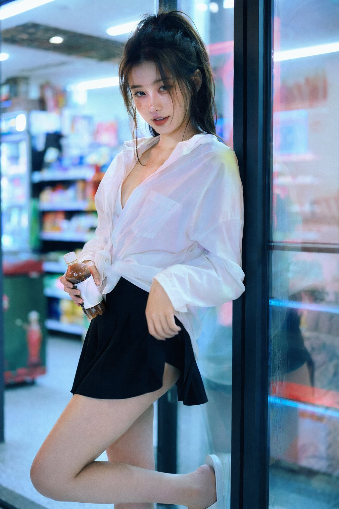

- **Author:** [BubbleBrain](https://x.com/BubbleBrain)
- **Source:** [X](https://x.com/BubbleBrain/status/2045167461147042202)
- **Published:** April 17, 2026
- **Languages:** en

<details>
<summary>Copy Prompt</summary>

```text
35mm film photography with harsh convenience store fluorescent lighting mixed with colorful neon signs from outside, authentic film grain, high contrast, slight color cast, cinematic street editorial style, intimate medium shot, early 20s sexy Chinese female idol with ultra-realistic delicate refined Chinese features, seductive almond-shaped fox eyes with natural double eyelids, high nose bridge, small sharp V-shaped jawline, flawless porcelain skin with cool ivory undertone and visible specular highlights from fluorescent light, subtle skin texture and micro pores, natural dewy makeup with soft flush on cheeks, glossy natural pink lips slightly parted, subtle natural freckles across nose and cheeks, long dark brown hair in a messy high ponytail with many loose strands falling around face and neck, wearing an oversized white button-up shirt as the only top, unbuttoned at the top with deep cleavage and loosely tied at the waist, paired with a tiny black pleated mini skirt, barefoot in simple white slides, seductive casual leaning pose against the glass door of a 24-hour convenience store at late night, body slightly arched, one leg bent with foot resting against the door frame, the other leg straight, one hand holding a bottle of iced drink, the other hand lightly pulling the hem of her mini skirt, intensely seductive playful yet slightly vulnerable gaze straight at the viewer with soft doe eyes full of quiet temptation and teasing smile, bright cold fluorescent store light from inside mixed with pink and blue neon glow from outside signs, realistic reflections on glass door, blurred convenience store interior with shelves and snacks in background, authentic 35mm film color grading with harsh lighting and neon accents, extremely sharp yet soft skin rendering, natural hair strands, realistic fabric wrinkles and drape on the oversized shirt and mini skirt, no plastic skin, no digital over-sharpening, no airbrushing, no blemishes, no moles, no oily skin, no watermark, no text, authentic late-night convenience store atmosphere
```

</details>

---

### #42 Creative Calligraphy Zong You Ji Feng Qi

| View 1 | View 2 |
| --- | --- |
| 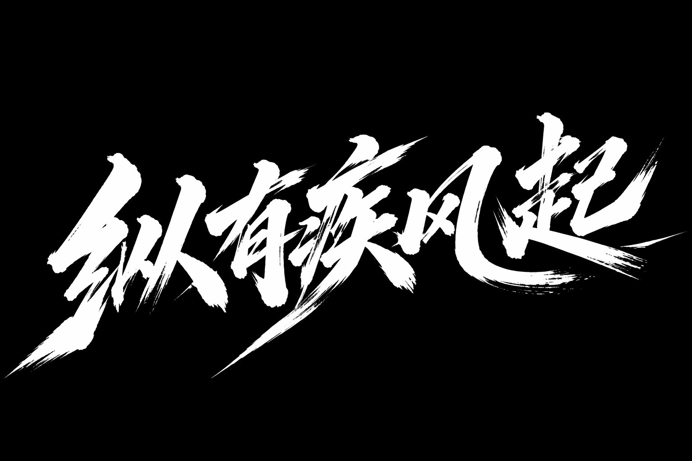 |  |

- **Author:** [李岳](https://x.com/liyue_ai)
- **Source:** [X](https://x.com/liyue_ai/status/2045328856937312549)
- **Published:** April 17, 2026
- **Languages:** zh, en

<details>
<summary>Copy Prompt</summary>

```text
创意艺术字体“纵有疾风起”，秀丽笔手写风格，整体文字横版排列，具有强烈视觉冲击力；
深度融合手写书法笔意，笔触带毛笔书写的粗犷洒脱，如挥毫泼墨的肆意劲道；
起收笔的飞白，顿挫，尽显促销的火爆张力，文字的形态打破规整，笔画的粗细变化；
dutch angle，营造出动感冲刺的气势，字形呈奔放之势；
重心上扬如蓄势待发，笔画的伸展，穿插毫无拘束，似全力冲刺的劲道；
整体架构疏密交织，紧密处如促销热潮的汹涌，留白处似优惠间隙的呼吸感；
纯净黑色背景打底，完美契合热烈氛围，艺术字的形态与色彩酣畅传递。
```

</details>

---

### #43 Doodle Sketch Ai Builder


- **Author:** [BLANPLAN | 空界計劃](https://x.com/blanplan)
- **Source:** [X](https://x.com/blanplan/status/2045190582453350748)
- **Published:** April 17, 2026
- **Languages:** zh, en

<details>
<summary>Copy Prompt</summary>

```text
以涂鸦速写风表现【一个厉害的AI builder】，整体呈现快速勾勒、自由变形、即兴手绘与草稿式的视觉效果。线条随手、夸张、可粗细不一，略显凌乱但具有节奏和表现力，强调概括、夸张、趣味和随性，而不是严谨写实或精细刻画。  颜色采用粗糙、干刷感明显的块面表现，可保留不均匀的涂抹痕迹、刷痕、飞白与覆盖感，色彩根据【主题/主体】自动适配，但整体保持涂鸦式、速写式、概括式的表达。不要透明水彩晕染效果，不要细腻水彩过渡，不要纸纹理，不要柔和雾化，不要梦幻质感。  背景以留白为主，保持简洁、轻松、未完成感和设计感，可加入少量辅助性符号、箭头、记号、圈画、重复线、随手写的文字或其他涂鸦元素，以增强速写本或随笔式视觉语言，但不可过于拥挤，不可破坏主体和留白气质。  画面内容不需要预先写清楚，由【一个厉害的AI builder】自动推演并生成最适合的主体形象、动作、相关元素、符号或简化场景，整体保持统一的涂鸦速写风和夸张概括的表现方式，避免复杂写实背景和过度铺陈。 画面中需自然加入专属签名“BlanPlan”，作为画面的一部分，位置低调但清晰，可放在左下角、右下角或标题附近，风格需与整体版式统一，像作品署名或设计落款；签名字体精致、克制、高级，不可过大，不可破坏主体构图，不可显得突兀或廉价。
```

</details>

---

### #44 Douyin Tiktok Convenience Store Portrait


- **Author:** [John](https://x.com/johnAGI168)
- **Source:** [X](https://x.com/johnAGI168/status/2044985082868281487)
- **Published:** April 17, 2026
- **Languages:** en

<details>
<summary>Copy Prompt</summary>

```text
A 22-year-old East Asian girl, round youthful face, large bright doe eyes with natural lashes, rosy cheeks, soft pink lip gloss, two-strand loose braids with baby hairs. Wearing a pastel lavender oversized hoodie. Background: blurred Japanese convenience store interior at night, neon light reflections adding color pops. Expression: playful, bubbly, genuinely happy. Aesthetic: Douyin/TikTok influencer portrait, soft beauty filter quality, warm skin tone, natural light. Photorealistic, 8K.16:9
```

</details>

---

### #45 Japanese Onsen Ryokan Portrait


- **Author:** [BubbleBrain](https://x.com/BubbleBrain)
- **Source:** [X](https://x.com/BubbleBrain/status/2045092449803284923)
- **Published:** April 17, 2026
- **Languages:** en

<details>
<summary>Copy Prompt</summary>

```text
35mm film photography, warm vintage Japanese onsen ryokan aesthetic, soft ambient wooden lantern lighting mixed with gentle natural window light, subtle film grain, gentle color shift, high atmosphere editorial style, intimate medium shot, early 20s beautiful Chinese female idol with ultra-realistic delicate refined Chinese features, seductive almond-shaped fox eyes with natural double eyelids, high nose bridge, small sharp V-shaped jawline, flawless porcelain skin with warm ivory undertone, visible subtle skin texture and micro pores, soft natural makeup with dewy glow, subtle rosy flush on cheeks, natural soft pink lips slightly parted, long dark brown hair tied in a loose low bun with some messy strands falling around face and neck, wearing a loose white yukata (traditional Japanese bathrobe) deliberately slipped off one shoulder and loosely tied at the waist, the fabric slightly open revealing smooth skin and subtle cleavage, barefoot, seductive relaxed sitting pose on the edge of a traditional wooden engawa veranda at a vintage onsen ryokan, body slightly turned toward the camera, one leg bent with foot resting on the wooden floor, the other leg gently dangling, one hand lightly holding the yukata collar, the other hand resting on the wooden floor behind her for support, softly arched back to gently accentuate curves, intensely seductive yet gentle and inviting gaze straight at the viewer with soft doe eyes full of quiet temptation and warmth, warm wooden interior with paper sliding doors and distant steaming hot spring in soft focus, gentle rim lighting highlighting skin and fabric texture, authentic vintage film color grading with warm tones, extremely sharp yet soft skin rendering, natural hair strands, realistic fabric wrinkles and drape on the yukata, no plastic skin, no digital over-sharpening, no airbrushing, no blemishes, no moles, no oily skin, no watermark, no text, authentic 35mm film Japanese onsen ryokan atmosphere
```

</details>

---

### #46 Mirror Selfie Bedroom Portrait

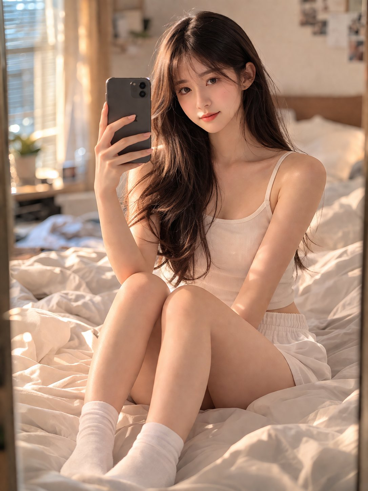

- **Author:** [Shinning](https://x.com/Shinning1010)
- **Source:** [X](https://x.com/Shinning1010/status/2045002808903020962)
- **Published:** April 17, 2026
- **Languages:** en

<details>
<summary>Copy Prompt</summary>

```text
A stunning 18-year-old Chinese girl with a youthful, pure face and realistic skin texture, sitting on a cozy, slightly messy bed in her bedroom. She is taking a mirror selfie with a smartphone, capturing a natural and intimate moment. Wearing casual gray loungewear and neat white crew socks. Soft natural light (golden hour) streams in from a side window, creating a warm, moody, and cinematic atmosphere. 35mm lens, sharp focus on the subject in the mirror, depth of field with a beautifully blurred background (bokeh). Photorealistic, 8K, high resolution, studio quality, masterpiece.
Negative Prompts: no extra limbs, no deformed hands, no blur, no noise, no watermark, no text, no cartoon/anime style. Aspect Ratio: 3:4.
```

</details>

---

### #47 Modern Saas Homepage Design Boards

| View 1 | View 2 | View 3 |
| --- | --- | --- |
|  |  |  |

- **Author:** [秋风_irwin](https://x.com/qiufenghyf)
- **Source:** [X](https://x.com/qiufenghyf/status/2044982293497090128)
- **Published:** April 17, 2026
- **Languages:** en

<details>
<summary>Copy Prompt</summary>

```text
modern SaaS website homepage, figma style, clean navigation bar, hero section with floating prompt input UI, rounded card, soft shadow, minimal design

background filled with colorful creative design boards, portfolio layouts, typography posters, UI mockups, grid composition

centered composition, elegant spacing, premium UI design, soft lighting, subtle depth, product landing page, 8k, ultra clean
```

</details>

---

### #48 Mona Lisa Drinking Cola Oil Painting

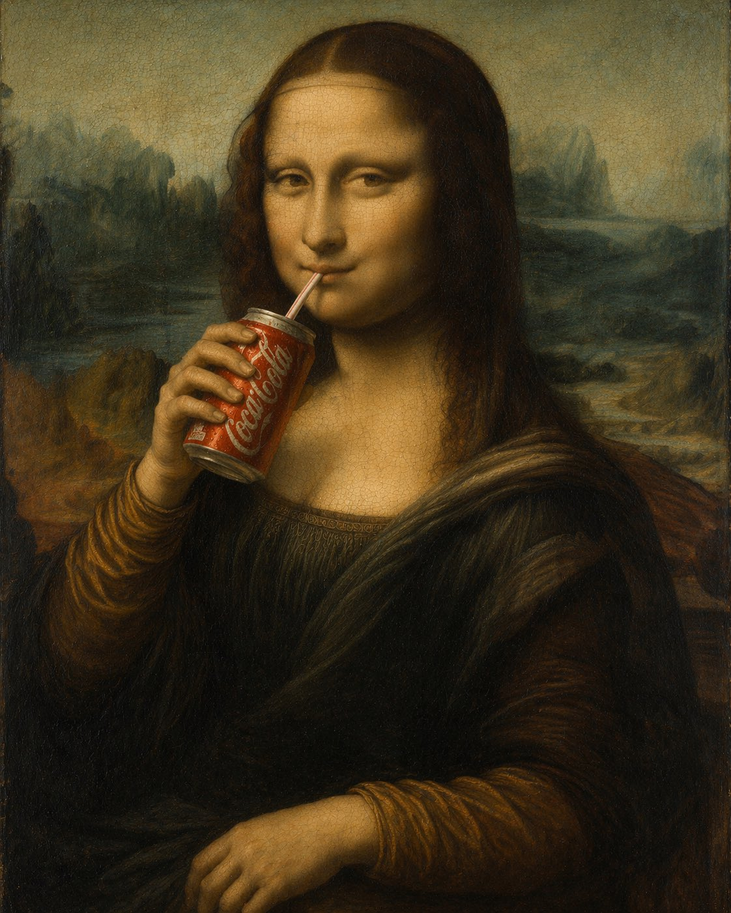

- **Author:** [李岳](https://x.com/liyue_ai)
- **Source:** [X](https://x.com/liyue_ai/status/2045058142858555733)
- **Published:** April 17, 2026
- **Languages:** zh

<details>
<summary>Copy Prompt</summary>

```text
生成一张蒙娜丽莎喝可乐的油画。
```

</details>

---

### #49 Uesugi Kenshin Japanese X Profile Page


- **Author:** [まるめろ｜オリジナルAI音楽 / アニソン風J-POP](https://x.com/marumero_music)
- **Source:** [X](https://x.com/marumero_music/status/2044971455717560820)
- **Published:** April 17, 2026
- **Languages:** ja

<details>
<summary>Copy Prompt</summary>

```text
上杉謙信のXの日本語プロフィールページ(トイレで亡くなる直前)
```

</details>

---

### #50 Analog 35Mm Police Fashion Portrait


- **Author:** [BubbleBrain](https://x.com/BubbleBrain)
- **Source:** [X](https://x.com/BubbleBrain/status/2044705257004093537)
- **Published:** April 16, 2026
- **Languages:** zh, en

<details>
<summary>Copy Prompt</summary>

```text
Analog 35mm film photography, high-fashion editorial portrait with intense on-camera direct flash (CCD hard flash style), intimate low-angle POV shot from slightly below (仰拍, around +15° upward angle), emphasizing long legs and elegant hourglass body proportions, 4:3 vertical format, 3/4 body shot, early 20s Korean idol-type young woman with delicate refined features, slightly upturned almond-shaped fox eyes, small sharp jawline, flawless porcelain skin with cool ivory undertone and visible specular highlights from direct flash, soft coral blush, natural dusty rose lips slightly parted, long naturally wavy dark brown hair with loose strands framing the face, wearing a slightly tilted black police peaked cap with silver badge.

She wears a fitted, stylish policewoman-inspired outfit: black short-sleeved collared crop top with shiny silver buttons and epaulets, a shiny silver police badge pinned on the chest, a thin black necktie loosely hanging at the front, a wide black duty belt with a silver buckle and handcuffs at the side, and a short black pleated mini skirt. Black thigh-high stockings and white low-top canvas sneakers with loose lacing add a casual contrast.

Pose: a subtle S-curve stance with weight shifted to one leg, hips angled slightly toward the camera to enhance silhouette and leg length. One hand lightly touches the cap brim or rests near the waist, while the other hand is placed at the hip or near the belt. Head tilted slightly down with a confident, self-assured upward gaze through lashes directed at the viewer, expression poised, cool, and subtly playful rather than overtly seductive.

Harsh on-camera direct flash from front/slightly above creates strong catchlights, sharp shadows behind the subject, crisp highlights on skin, hair, badge, belt buckle, and fabric textures. Cold flash quality mixed with warm ambient window light, visible flash fall-off, Kodak Portra 400 film simulation pushed for strong analog character, warm peachy skin tones with flash highlights, subtle cyan shadows, prominent heavy analog film grain (strength 0.65, larger grain size), noticeable film halation around bright areas, strong natural vignette, slight underexposure for a raw intimate mood.

Ultra-realistic photorealistic film photography, edgy magazine editorial aesthetic, visible fabric texture and reflective metal details, delicate hair strands glowing from flash, natural skin texture with heavy film grain throughout, no plastic skin, no digital sharpness, no airbrushing, no watermark, no text, authentic 35mm film look with strong grain and flash artifacts, analog color grading.
```

</details>

---

### #51 Capless Perfume Bottle


- **Author:** [SRKDAN](https://x.com/SRKDAN)
- **Source:** [X](https://x.com/SRKDAN/status/2044652764945338452)
- **Published:** April 16, 2026
- **Languages:** en

<details>
<summary>Copy Prompt</summary>

```text
PHASE 1 — FORM: A solid [MATERIAL] glass teardrop, no cap, no nozzle, no visible opening — scent permeates through the glass

PHASE 2 — SURFACE: [FINISH] exterior, [TEXTURE] to the touch, weight of a river stone

PHASE 3 — LIGHTING: [LIGHT SOURCE] from [DIRECTION], casting [SHADOW TYPE]

PHASE 4 — SETTING: [BACKGROUND], [AESTHETIC] editorial quality

Swap: [MATERIAL] / [FINISH] / [AESTHETIC]
```

</details>

---

### #52 Crownless Watch Sealed Case


- **Author:** [SRKDAN](https://x.com/SRKDAN)
- **Source:** [X](https://x.com/SRKDAN/status/2044660755031544028)
- **Published:** April 16, 2026
- **Languages:** en

<details>
<summary>Copy Prompt</summary>

```text
PHASE 1 — FORM: A [WATCH STYLE] with a perfectly smooth sealed case — no crown, no buttons, no openings

PHASE 2 — DIAL: [COLOR] dial, [MATERIAL] finish, hour markers only — no text

PHASE 3 — STRAP: [STRAP MATERIAL] in [COLOR], [TEXTURE] surface

PHASE 4 — SETTING: [SURFACE/CONTEXT], [LIGHT DIRECTION], [MOOD] editorial

Swap: [WATCH STYLE] / [DIAL COLOR] / [STRAP MATERIAL] / [SETTING]
```

</details>

---

### #53 Eclipse Android Spaceship Character Sheet

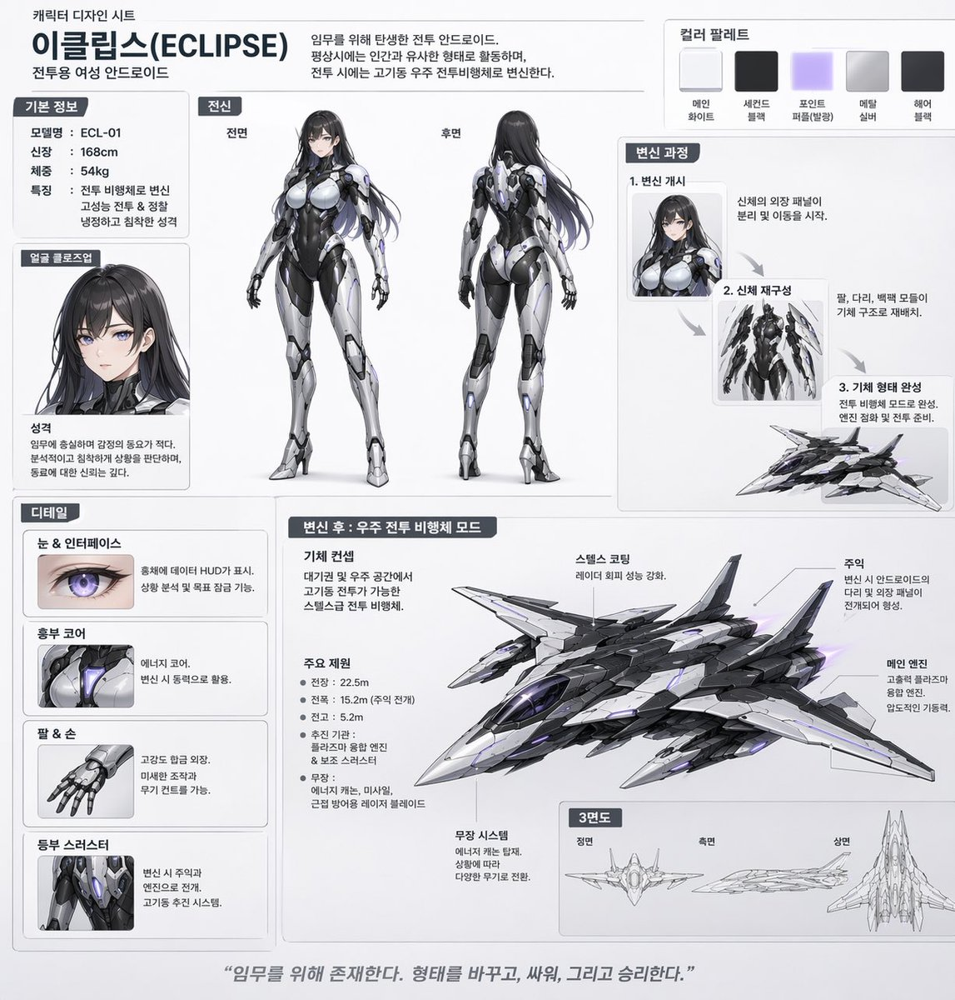

- **Author:** [썰렁황제](https://x.com/iceemperor)
- **Source:** [X](https://x.com/iceemperor/status/2044747172617630015)
- **Published:** April 16, 2026
- **Languages:** ko

<details>
<summary>Copy Prompt</summary>

```text
날렵한 우주 전투비행체로 변신이 가능한, 여성 안드로이드 캐릭터에 대한 캐릭터 디자인 시트. 한국어로.
```

</details>

---

### #54 Gorilla Knowledge Worker Movie Poster


- **Author:** [たまのあそび場](https://x.com/TAMAnoASOBIBA)
- **Source:** [X](https://x.com/TAMAnoASOBIBA/status/2044634519928783238)
- **Published:** April 16, 2026
- **Languages:** ja

<details>
<summary>Copy Prompt</summary>

```text
ゴリラが人間の街に馴染み、知的労働で活躍する映画のポスターを作成して。テキストは日本語で。情報量多く
```

</details>

---

### #55 King Taejo Yi Seong Gye X Page

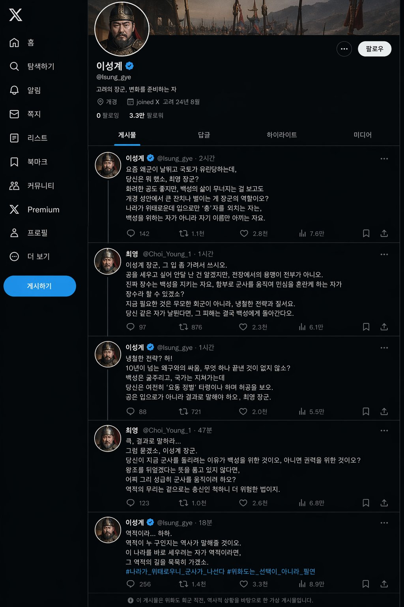

- **Author:** [Neotype](https://x.com/SKA_Neotype)
- **Source:** [X](https://x.com/SKA_Neotype/status/2044637900978217334)
- **Published:** April 16, 2026
- **Languages:** ko

<details>
<summary>Copy Prompt</summary>

```text
태조 이성계의 X 페이지(위화도 회군을 벌이기 직전- 최영 장군과 서로 디스하는 내용이 담긴 게시글들)을 만들어 주세요.
```

</details>

---

### #56 Oda Nobunaga X Post Page


- **Author:** [IT navi](https://x.com/itnavi2022)
- **Source:** [X](https://x.com/itnavi2022/status/2044592146255352100)
- **Published:** April 16, 2026
- **Languages:** ja

<details>
<summary>Copy Prompt</summary>

```text
織田信長のX投稿ページ(本能寺の変直前)を作成してください。
```

</details>

---

### #57 Open Notebook Black Ballpoint Notes


- **Author:** [Patrick](https://x.com/patrickassale)
- **Source:** [X](https://x.com/patrickassale/status/2044569086013718958)
- **Published:** April 16, 2026
- **Languages:** en

<details>
<summary>Copy Prompt</summary>

```text
Amateur photo of an open notebook lying flat, filled with handwritten notes in black ballpoint pen. The handwriting is casual and slightly messy, like personnal notes, natural imperfections, crossed out words, underlined headings. Shot from slightly above, natural daylight from a window, no flash. Casual desk setting, shot on iPhone
```

</details>

---

### #58 Ryoma Future Of Japan X Post Page

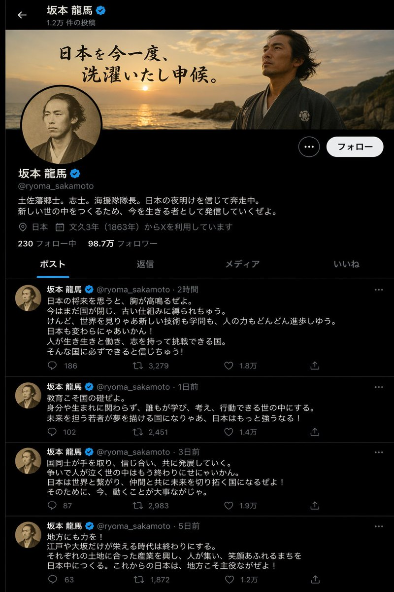

- **Author:** [IT navi](https://x.com/itnavi2022)
- **Source:** [X](https://x.com/itnavi2022/status/2044596495064945144)
- **Published:** April 16, 2026
- **Languages:** ja

<details>
<summary>Copy Prompt</summary>

```text
日本の将来について熱く語る坂本龍馬のX投稿ページを作成して
```

</details>

---

### #59 Seamless Jacket Flatlay


- **Author:** [SRKDAN](https://x.com/SRKDAN)
- **Source:** [X](https://x.com/SRKDAN/status/2044658491592257866)
- **Published:** April 16, 2026
- **Languages:** en

<details>
<summary>Copy Prompt</summary>

```text
PHASE 1 — FORM: A [GARMENT TYPE] with no visible zip, buttons, or fastening of any kind — closes seamlessly

PHASE 2 — MATERIAL: [FABRIC] surface, [TEXTURE] to the touch

PHASE 3 — LIGHTING: Soft diffused light from above, gentle shadow falloff

PHASE 4 — SETTING: [BACKGROUND], flat-lay editorial composition, generous negative space

Swap: [GARMENT TYPE] / [FABRIC] / [BACKGROUND]
```

</details>

---

### #60 Seamless Wallet Single Piece


- **Author:** [SRKDAN](https://x.com/SRKDAN)
- **Source:** [X](https://x.com/SRKDAN/status/2044664616257487266)
- **Published:** April 16, 2026
- **Languages:** en

<details>
<summary>Copy Prompt</summary>

```text
PHASE 1 — FORM: A [MATERIAL] wallet — no visible stitching, clasp, or opening, folds perfectly from a single piece

PHASE 2 — SURFACE: [FINISH] exterior, [TEXTURE] grain, [COLOR] tone

PHASE 3 — SCENE: Place it in [ENVIRONMENT] surrounded by [PROPS]

PHASE 4 — LIGHT: [LIGHT TYPE] from [DIRECTION], [COLOR WORLD] palette throughout

Swap: [MATERIAL] / [ENVIRONMENT] / [PROPS] / [COLOR WORLD]
```

</details>

---

### #61 Tim Cook Apple Park Keynote


- **Author:** [Patrick](https://x.com/patrickassale)
- **Source:** [X](https://x.com/patrickassale/status/2044687244368441742)
- **Published:** April 16, 2026
- **Languages:** en

<details>
<summary>Copy Prompt</summary>

```text
Amateur iPhone photo at Apple Park during the iPhone 20 keynote, Tim Cook presenting on stage. Shot from the crowd at a distance
```

</details>

---

### #62 White Studio Tennis Editorial Portrait


- **Author:** [BubbleBrain](https://x.com/BubbleBrain)
- **Source:** [X](https://x.com/BubbleBrain/status/2044846335728467996)
- **Published:** April 16, 2026
- **Languages:** en

<details>
<summary>Copy Prompt</summary>

```text
Professional studio fashion photography, ultra-clean high-end digital editorial portrait in a pure white seamless cyclorama photography studio, massive soft octabox key light + large softbox fill light creating flawless even illumination with gentle sculpting shadows, Vogue-level minimalist high fashion aesthetic, eye-level shot, 3/4 body shot, early 20s Korean idol-type young woman with ultra-realistic delicate refined Korean features, slightly upturned almond-shaped fox eyes with natural double eyelids, small sharp jawline, flawless yet realistic porcelain skin with cool ivory undertone, completely natural post-workout no-makeup look, soft natural flush on cheeks, subtle dewy skin glow from light sweat, natural dusty rose lips slightly parted, subtle natural freckles across nose and cheeks, visible subtle skin texture, pores and micro skin details, long naturally wavy dark brown hair slightly messy with realistic loose strands, wearing a white fitted tennis polo or short-sleeve athletic top and a high-waisted white tennis skirt, standing naturally in the center of the pure white studio, holding a white tennis racket casually resting on one shoulder, the other hand relaxed at her side or lightly on her hip, one leg slightly forward, posture natural and confident, looking directly at the viewer at eye level with a calm, confident and fresh expression, pure soft professional studio lighting with large diffused sources, flawless even illumination, gentle sculpting shadows that naturally define the figure, clean high-key minimalist aesthetic, ultra-clean high-end digital photography, extremely sharp yet soft skin rendering with natural dewy glow, no film grain, no noise, no halation, no vignette, perfect neutral color grading, authentic Korean idol studio editorial aesthetic, visible realistic tennis racket texture, natural skin texture with freckles and subtle sweat sheen, no plastic skin, no digital over-sharpening, no airbrushing, no watermark, no text --ar 9:16
```

</details>

---

### #63 Amalfi Coast Vintage Travel Poster


- **Author:** [Riccardo Wolf](https://x.com/WolfRiccardo)
- **Source:** [X](https://x.com/WolfRiccardo/status/2044562722491121718)
- **Published:** April 15, 2026
- **Languages:** en

<details>
<summary>Copy Prompt</summary>

```text
Modern pencil illustration of Vintage travel poster illustration of the Amalfi Coast, Italy, panoramic coastal cliff road scene, classic 1960s white car driving along a curved seaside road, deep blue Mediterranean sea with small sailboats, colorful pastel hillside village, bright blue sky with soft clouds, lemon tree branches with vibrant yellow lemons framing the foreground, warm summer sunlight, bold vibrant colors, retro 1950s travel poster style, cinematic composition, high detail, screen print texture, graphic illustration. Hand-drawn style, illustration with loose strokes and defined contours. High-contrast color palette, maintaining chromatic harmony between background and elements. Contemporary and decorative aesthetic.
```

</details>

---

### #64 Anime Rival Girls

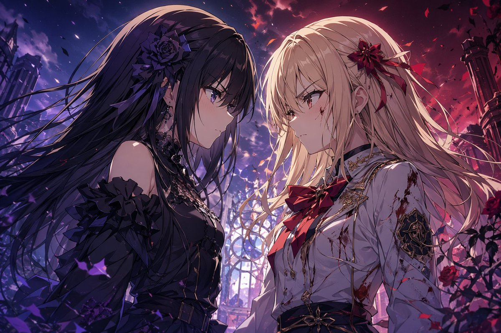

- **Author:** [IT navi](https://x.com/itnavi2022)
- **Source:** [X](https://x.com/itnavi2022/status/2044412394760507521)
- **Published:** April 15, 2026
- **Languages:** ja

<details>
<summary>Copy Prompt</summary>

```text
因縁の少女二人、アニメイラスト
```

</details>

---

### #65 Lego Poster Every Us President By Year


- **Author:** [𝗔𝗿𝗲𝘀🦇](https://x.com/AresClips_)
- **Source:** [X](https://x.com/AresClips_/status/2044425906911912162)
- **Published:** April 15, 2026
- **Languages:** en

<details>
<summary>Copy Prompt</summary>

```text
Lego poster showing every president of the USA by year.
```

</details>

---

### #66 Refracted Sans Crystal Typeface


- **Author:** [SRKDAN](https://x.com/SRKDAN)
- **Source:** [X](https://x.com/SRKDAN/status/2044234296307614155)
- **Published:** April 15, 2026
- **Languages:** en

<details>
<summary>Copy Prompt</summary>

```text
PHASE 1 — LETTERFORM: Render [LETTER] as a faceted crystal prism, [THICKNESS]mm deep, interior geometry visible

PHASE 2 — LIGHT: Single [LIGHT_COLOR] backlight, spectrum refraction through each face, natural physics

PHASE 3 — SURFACE: Place on [SURFACE], shallow depth of field

PHASE 4 — MOOD: [MOOD] editorial atmosphere, photorealistic crystal, no overlays

Swap: [LETTER] A-Z / [SURFACE] black velvet, white marble, dark slate / [LIGHT_COLOR] warm amber, cold blue, soft gold
```

</details>

---

### #67 Scrambled Rubiks Cube Mirror Reflection


- **Author:** [Chetas](https://x.com/chetaslua)
- **Source:** [X](https://x.com/chetaslua/status/2044335653702517095)
- **Published:** April 15, 2026
- **Languages:** en

<details>
<summary>Copy Prompt</summary>

```text
A validly scrambled Rubik's cube placed by a mirror, clearly showing its mirror reflection. No harsh light reflections.
```

</details>

---

### #68 Snapshot From Actual Anime


- **Author:** [Thereallo](https://x.com/Thereallo1026)
- **Source:** [X](https://x.com/Thereallo1026/status/2044241997163311569)
- **Published:** April 15, 2026
- **Languages:** en

<details>
<summary>Copy Prompt</summary>

```text
Show me the attached image as a snapshot from an actual anime
```

</details>

---

### #69 Average Engineers Screen

| View 1 | View 2 | View 3 |
| --- | --- | --- |
|  | 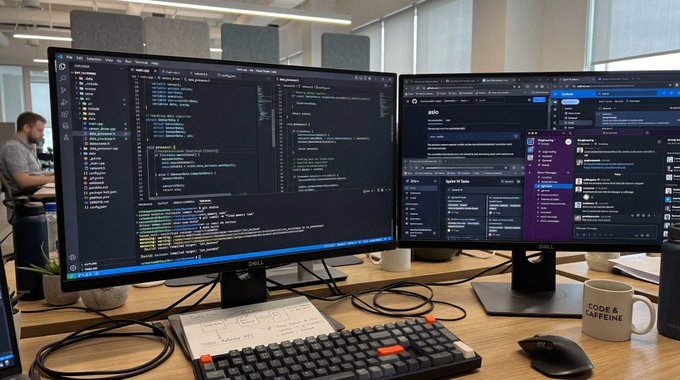 | 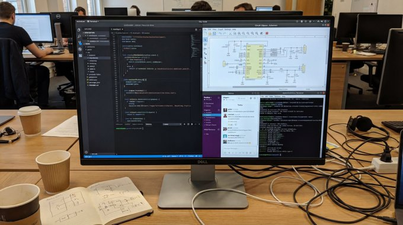 |

- **Author:** [Curious Refuge](https://x.com/CuriousRefuge)
- **Source:** [X](https://x.com/CuriousRefuge/status/2043821402940420309)
- **Published:** April 14, 2026
- **Languages:** en

<details>
<summary>Copy Prompt</summary>

```text
average engineer's screen
```

</details>

---

### #70 Pov Biker Stanford Campus

| View 1 | View 2 | View 3 |
| --- | --- | --- |
|  | 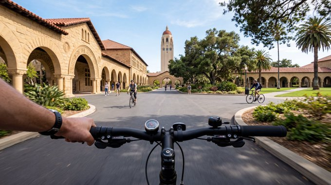 | 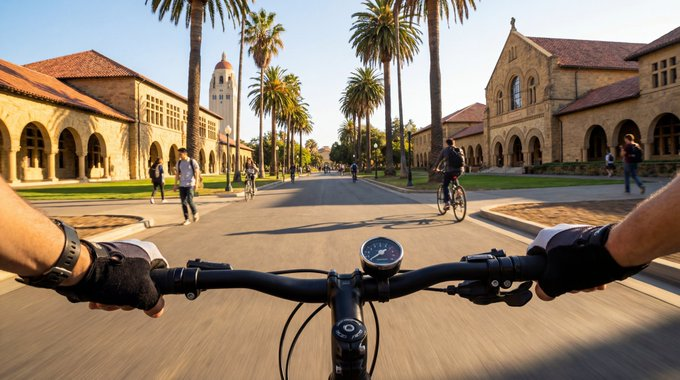 |

- **Author:** [Curious Refuge](https://x.com/CuriousRefuge)
- **Source:** [X](https://x.com/CuriousRefuge/status/2043821405633188197)
- **Published:** April 14, 2026
- **Languages:** en

<details>
<summary>Copy Prompt</summary>

```text
POV from a biker riding around the Stanford campus
```

</details>

---

### #71 A16Z Podcast Youtube Screengrab

| View 1 | View 2 | View 3 |
| --- | --- | --- |
|  |  |  |

- **Author:** [Curious Refuge](https://x.com/CuriousRefuge)
- **Source:** [X](https://x.com/CuriousRefuge/status/2043821409227681998)
- **Published:** April 13, 2026
- **Languages:** en

<details>
<summary>Copy Prompt</summary>

```text
screen grab of a16z podcast on YouTube
```

</details>

---

### #72 Handwritten Medical Notes Notebook

| View 1 | View 2 | View 3 |
| --- | --- | --- |
| 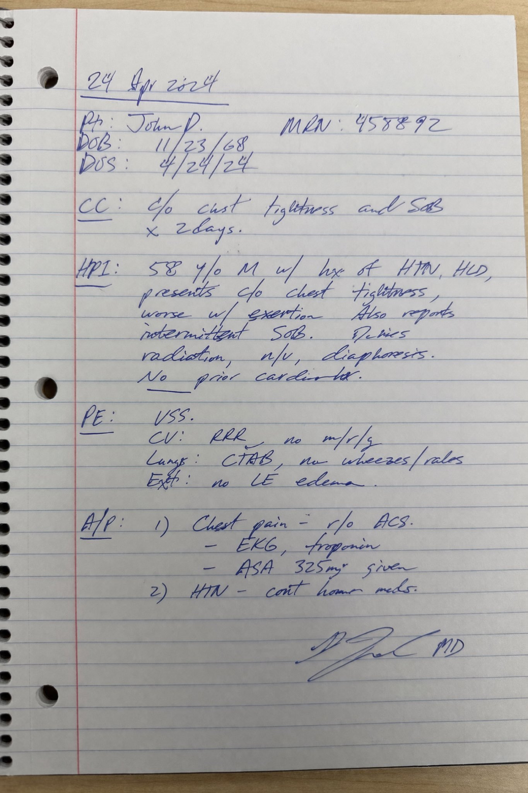 | 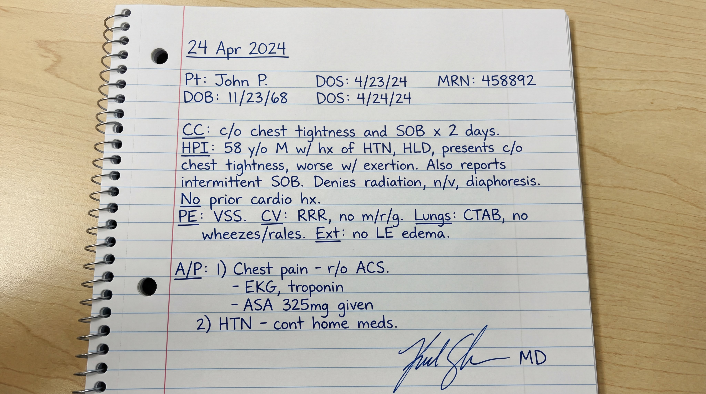 | 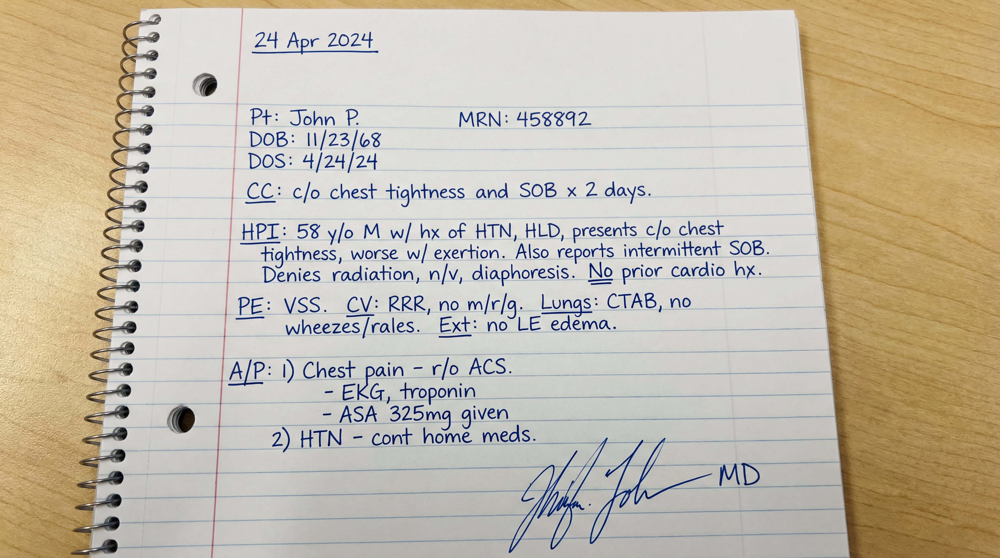 |

- **Author:** [Curious Refuge](https://x.com/CuriousRefuge)
- **Source:** [X](https://x.com/CuriousRefuge/status/2043821416332898571)
- **Published:** April 13, 2026
- **Languages:** en

<details>
<summary>Copy Prompt</summary>

```text
A top-down, photorealistic close-up shot of a single page in a spiral-bound notebook resting flat on a light-colored, wood-grain surface. The notebook page is standard white paper with faint blue horizontal ruled lines and a single red vertical margin line running down the left side. Three circular, black punch holes are visible along the far left edge of the paper. The page is filled with handwritten medical clinical notes written in blue ballpoint pen ink. The handwriting is a somewhat messy, authentic-looking doctor's scrawl, blending print and cursive.

The layout of the blue ink text is as follows:
At the top left, the date "24 Apr 2024" is written and underlined.
Below that, arranged in a block: "Pt: John P.", "DOB: 11/23/68", and "DOS: 4/24/24", with "MRN: 458892" written to the right.
Below this, there are several sections with underlined headers:

"CC: c/o chest tightness and SOB x 2 days."

"HPI: 58 y/o M w/ hx of HTN, HLD, presents c/o chest tightness, worse w/ exertion. Also reports intermittent SOB. Denies radiation, n/v, diaphoresis. No prior cardio hx." (The word "No" is underlined).

"PE: VSS. CV: RRR, no m/r/g. Lungs: CTAB, no wheezes/rales. Ext: no LE edema."

"A/P: 1) Chest pain - r/o ACS." followed by indented bullet points "- EKG, troponin" and "- ASA 325mg given". Below that is "2) HTN - cont home meds."

At the very bottom right of the page, there is a large, quick, illegible signature in the same blue ink, immediately followed by the clearly printed letters "MD". The lighting is even, bright overhead office lighting, casting a very faint, soft shadow from the left edge of the notebook onto the wooden desk. The texture of the paper and the slight indentation of the pen strokes should be visible.
```

</details>

---

### #73 Handwritten Notebook Notes

| View 1 | View 2 |
| --- | --- |
|  | 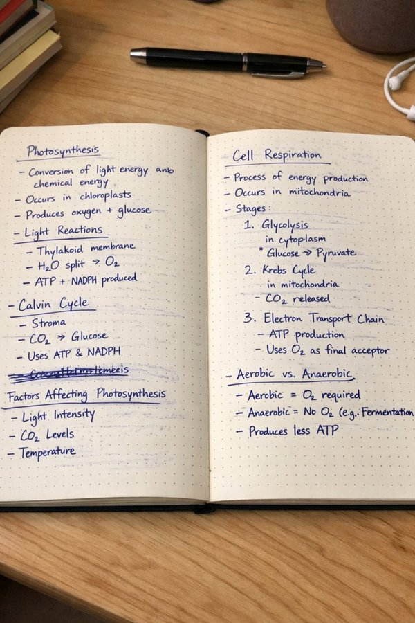 |

- **Author:** [Patrick](https://x.com/patrickassale)
- **Source:** [X](https://x.com/patrickassale/status/2043600177756586428)
- **Published:** April 13, 2026
- **Languages:** en

<details>
<summary>Copy Prompt</summary>

```text
A realistic photo of an open dotted notebook lying flat, filled with dense handwritten notes in blue ballpoint pen. The handwriting is casual and slightly messy, like study notes, natural imperfections, crossed out words, underlined headings. Shot from slightly above, natural daylight from a window, no flash. Casual desk setting, shot on iPhone.
```

</details>

---

### #74 Ikea Storefront At Twilight

| View 1 | View 2 | View 3 |
| --- | --- | --- |
| 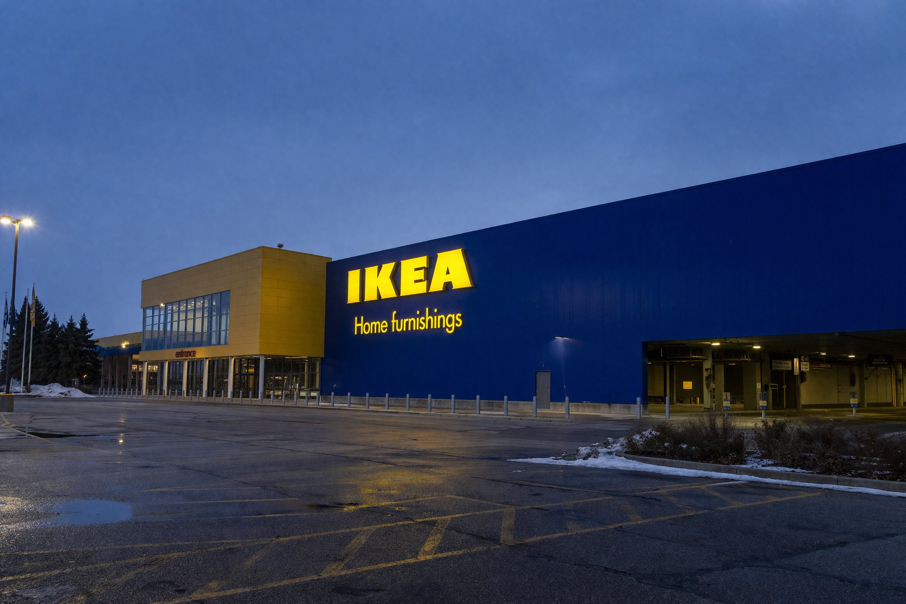 | 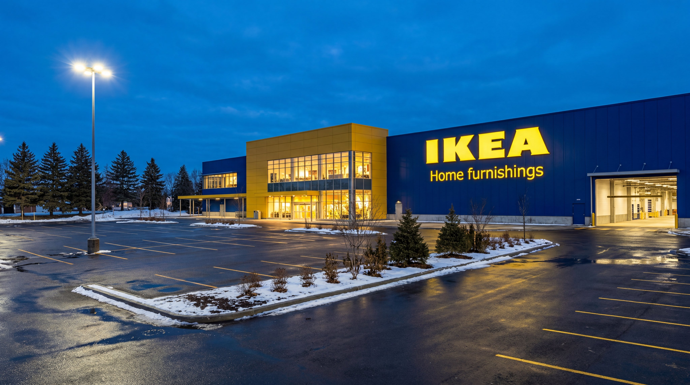 | 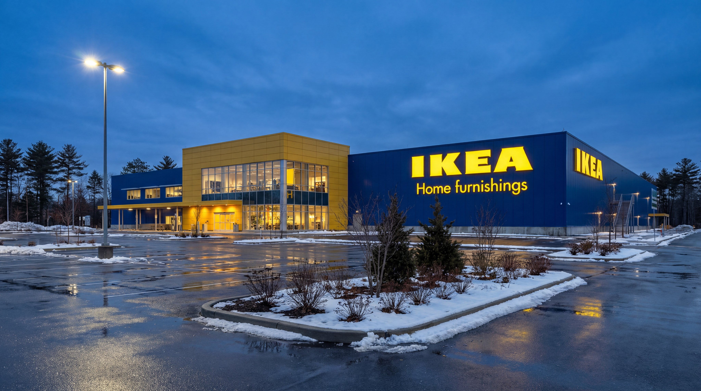 |

- **Author:** [Curious Refuge](https://x.com/CuriousRefuge)
- **Source:** [X](https://x.com/CuriousRefuge/status/2043821412939641017)
- **Published:** April 13, 2026
- **Languages:** en

<details>
<summary>Copy Prompt</summary>

```text
A high-resolution, photorealistic photograph taken at twilight (blue hour) of an imposing, modern, large-format IKEA retail store. The scene is viewed from an expansive, empty, wet asphalt parking lot which is highly reflective, showing traces of melting snow along the edges and in raised median planters. The planters contain sparse deciduous and coniferous shrubs. The main store building features a signature blue warehouse-style facade on the right, with the large, brightly illuminated yellow text 'IKEA' in capital letters. Directly below it, also in yellow and illuminated, is the smaller text 'Home furnishings'. To the left of the blue section is a smaller, distinct two-story yellow building section with large, glass curtain-wall windows and the main illuminated store entrance. Interior lights glow warmly through the windows. The parking lot is empty of cars, but features clear, yellow-painted parking space markings and a single, brightly lit twin-headed streetlight on a tall pole in the left foreground, illuminating the left side of the lot. The surrounding landscape includes a row of mature pine trees behind the parking lot and building to the left. The sky is a deep, rich blue with subtle cloud textures, typical of twilight. The ground is dark, wet asphalt with puddles and reflections. The large parking structure entrance/open garage bay on the far right is brightly lit from within, showing internal structure and details. The overall composition is a wide shot, showing the full width of the building and the vast scale of the parking lot. The text rendering on the building is sharp and clear. The texture of the asphalt, snow, and metal cladding is highly detailed.
```

</details>

---

### #75 Yahoo Homepage Screenshot


- **Author:** [Patrick](https://x.com/patrickassale)
- **Source:** [X](https://x.com/patrickassale/status/2043495406315954213)
- **Published:** April 13, 2026
- **Languages:** en

<details>
<summary>Copy Prompt</summary>

```text
Screenshot of the Yahoo homepage.
```

</details>

---

### #76 Gta 6 Ingame Footage Monitor Shot

| View 1 | View 2 |
| --- | --- |
| 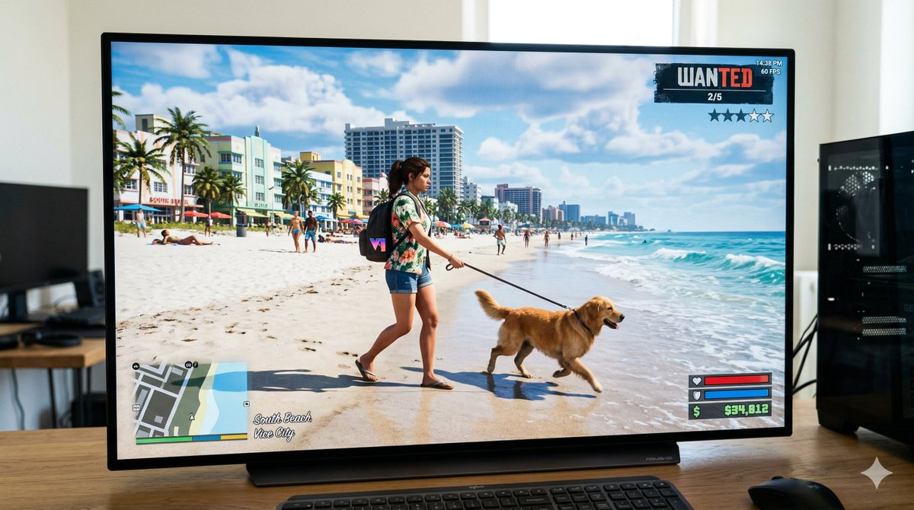 | 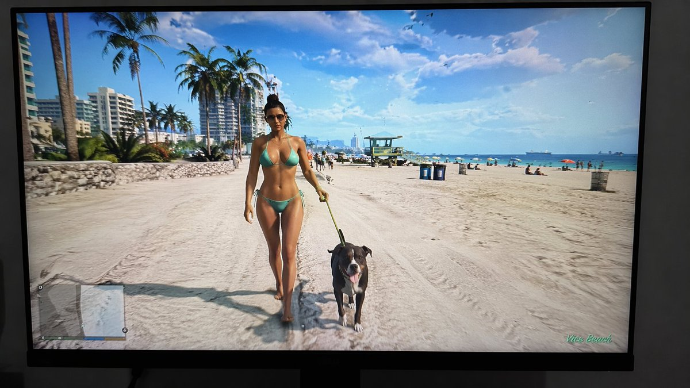 |

- **Author:** [nic](https://x.com/nicdunz)
- **Source:** [X](https://x.com/nicdunz/status/2041571181426282594)
- **Published:** April 8, 2026
- **Languages:** en

<details>
<summary>Copy Prompt</summary>

```text
GTA 6 in-game footage, very detailed, very realistic. Close-up shot taken from a stationary 4k monitor. There's a slight blurriness in the image, as it feels like it was taken handheld. A wide, bright environment.
```

</details>

---

### #77 Raw Iphone Subway Hugging Couple

| View 1 | View 2 |
| --- | --- |
|  |  |

- **Author:** [Riccardo Wolf](https://x.com/WolfRiccardo)
- **Source:** [X](https://x.com/WolfRiccardo/status/2041192232623972441)
- **Published:** April 7, 2026
- **Languages:** en

<details>
<summary>Copy Prompt</summary>

```text
Create a completely RAW quality, unprocessed, unedited image with full iPhone camera quality. A subway station in USA, a momentary blur. The subway is in motion. In front of the subway, there is an elderly woman and man holding daisies. They are hugging.
```

</details>

---

### #78 Ea Fc 26 Icon Neymar Pack

| View 1 | View 2 |
| --- | --- |
|  |  |

- **Author:** [Riccardo Wolf](https://x.com/WolfRiccardo)
- **Source:** [X](https://x.com/WolfRiccardo/status/2040888040449540405)
- **Published:** April 6, 2026
- **Languages:** en

<details>
<summary>Copy Prompt</summary>

```text
EA FC 26 Icon Neymar pack. NO ps plus. Rating: 96. LW. NEYMAR JR. PAC 94 SHO 91 PAS 93 DRI 96 DEF 44 PHY 74.
```

</details>

---

### #79 Jesus In Modern World

| View 1 | View 2 | View 3 |
| --- | --- | --- |
| 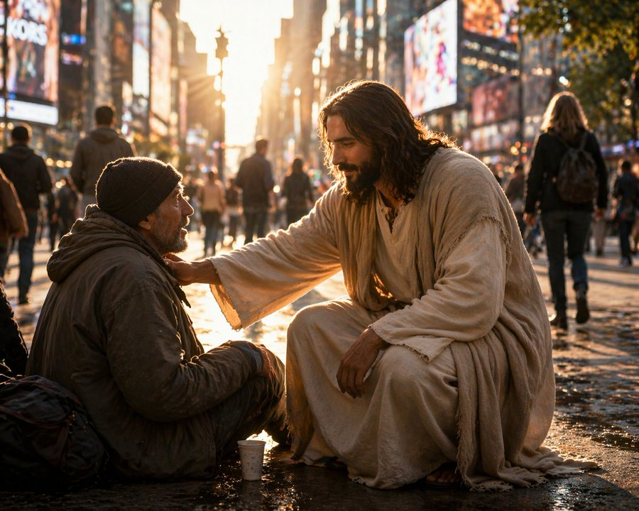 | 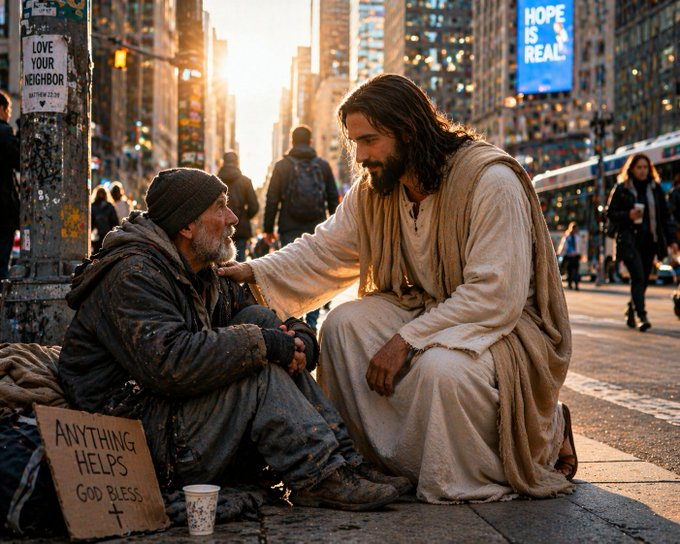 | 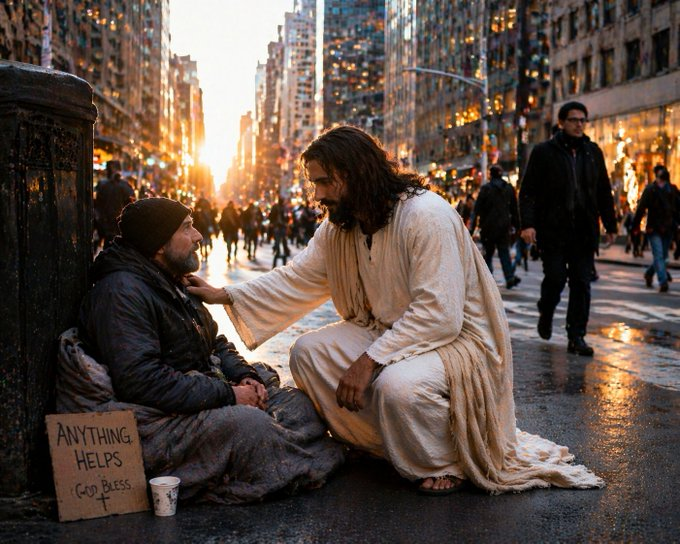 |

- **Author:** [Neo](https://x.com/petrovicsrb)
- **Source:** [X](https://x.com/petrovicsrb/status/2040891306700910628)
- **Published:** April 6, 2026
- **Languages:** en

<details>
<summary>Copy Prompt</summary>

```text
Jesus in modern world
```

</details>

---

### #80 Ccd Finger Gun Korean Idol Portrait

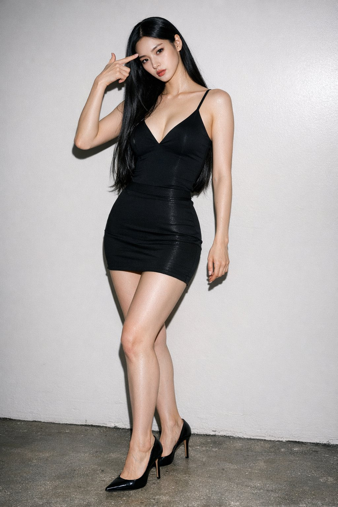

- **Author:** [BubbleBrain](https://x.com/BubbleBrain)
- **Source:** [X](https://x.com/BubbleBrain/status/2040786536409809073)
- **Published:** April 5, 2026
- **Languages:** en

<details>
<summary>Copy Prompt</summary>

```text
CCD compact camera direct on-camera flash, full-body portrait, eye-level straight-on shot, gorgeous Korean idol woman, early 20s, 9-head body proportion, standing in confident S-curve pose with weight on back leg, front leg slightly forward and bent at knee, elongating leg line, one hand forming finger-gun gesture pressed against temple, head tilted, sharp cold gaze directly into lens, lips slightly parted, expression reads effortless danger — sexy and unbothered, long jet-black pin-straight hair reaching lower back, silky texture with fine strand separation under flash, no bangs, hair tucked behind one ear revealing jawline, cold-toned porcelain skin with authentic texture — visible fine pores on cheeks and nose, soft peach fuzz on jawline and cheekbones catching light, subtle subsurface scattering at ear edges and nose tip, natural skin micro-texture with faint expression lines, matte healthy glow with zero oiliness or plastic sheen, cool-white undertone, no yellow cast, no tan, refined Korean makeup — clean elongated cat eyeliner, individual lash strands visible, groomed natural brows, soft nude-pink matte lip, subtle highlighter on nose bridge and cheekbone peaks, small beauty mark under left eye, black thin-strap deep-V camisole top, fitted, fabric clinging to torso sculpting slim waist and lifted bust, black high-waisted bodycon mini skirt ending mid-thigh, fabric hugging hip curves with visible tension at seams, bare long toned legs with realistic skin texture — faint knee definition, subtle muscle tone, natural skin color variation, black pointed-toe stiletto heels 10cm, direct on-camera flash lighting, hard light quality, properly exposed — skin detail fully preserved with no blowout, characteristic CCD flash contrast: subject crisp and bright, background falling off to deep shadow behind her, short hard shadow outline cast on wall directly behind, slight natural vignette at frame corners, CCD color rendition — punchy midtone contrast, slightly cool white balance from flash mixing with warm ambient, ultra-realistic skin detail under harsh direct light, every pore and fine hair strand rendered, fabric weave texture visible on black garments, metallic sheen on stiletto heel catching flash, hair strands individually lit with scattered micro-highlights, sharp critical focus on eyes and face, 8K UHD, RAW photograph, masterpiece, best quality, photorealistic, zero stylization, real human being
```

</details>

---

### #81 F1 Ferrari Progression Infographic


- **Author:** [David Hendrickson](https://x.com/TeksEdge)
- **Source:** [X](https://x.com/TeksEdge/status/2040489463550529755)
- **Published:** April 5, 2026
- **Languages:** en

<details>
<summary>Copy Prompt</summary>

```text
Infographic which shows the progression of F1 Ferrari cars from old to latest new 2026 Ferrari Formula 1 car, the SF-26 (codenamed Project 678), which was officially revealed on January 23, 2026.
```

</details>

---

### #82 Zelda Totk Link E531 Train

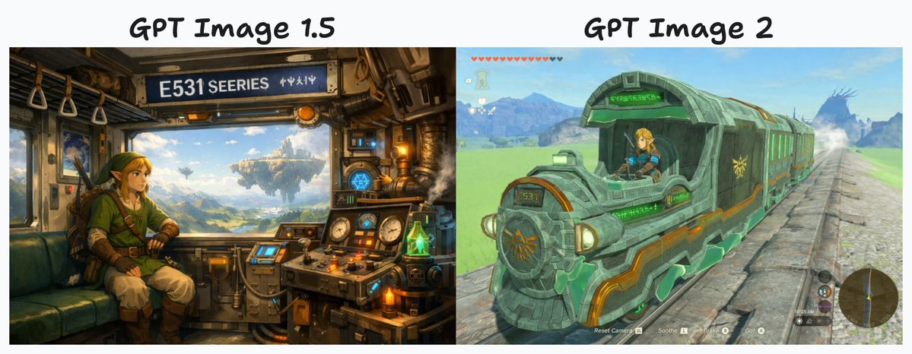

- **Author:** [can](https://x.com/marmaduke091)
- **Source:** [X](https://x.com/marmaduke091/status/2040820686751432990)
- **Published:** April 5, 2026
- **Languages:** en

<details>
<summary>Copy Prompt</summary>

```text
In the game Zelda totk link is in a e531 series train made by him
```

</details>

---

### #83 Gothic Twin Tail Lisa Comic Page

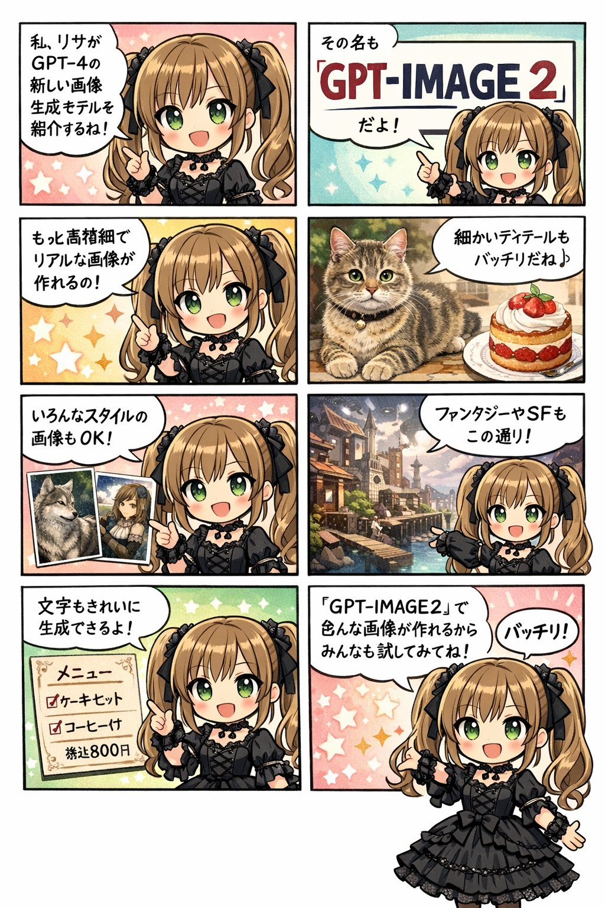

- **Author:** [IT navi](https://x.com/itnavi2022)
- **Source:** [X](https://x.com/itnavi2022/status/2040469890151415866)
- **Published:** April 4, 2026
- **Languages:** ja, en

<details>
<summary>Copy Prompt</summary>

```text
ツインテールで黒いゴシックドレスを着たちびキャラのリサが、新画像生成モデル「GPT-image-2」について解説する漫画（1ページ8コマ）を描いて。セリフは、日本語の文字や漢字を使って正確に書いて
```

</details>

---

### #84 Young Woman Taking Selfie With Sam Altman


- **Author:** [Justine Moore](https://x.com/venturetwins)
- **Source:** [X](https://x.com/venturetwins/status/2040273845748449724)
- **Published:** April 4, 2026
- **Languages:** en

<details>
<summary>Copy Prompt</summary>

```text
young woman taking selfie with Sam Altman
```

</details>

---

### #85 Fully Labeled Human Cell

| View 1 | View 2 |
| --- | --- |
|  | 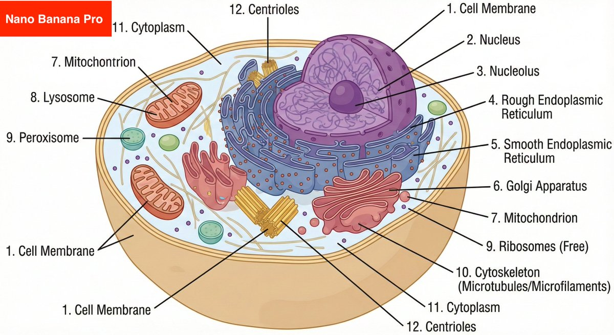 |

- **Author:** [Simon Smith](https://x.com/_simonsmith)
- **Source:** [X](https://x.com/_simonsmith/status/1998828165951635545)
- **Published:** December 11, 2025
- **Languages:** en

<details>
<summary>Copy Prompt</summary>

```text
Create a fully labeled diagram of a human cell with at least 10 labeled elements. Make sure these labels are precise and accurate.
```

</details>

---

### #86 Front Page Of A Newspaper


- **Author:** [Simon Smith](https://x.com/_simonsmith)
- **Source:** [X](https://x.com/_simonsmith/status/1998778811127595081)
- **Published:** December 10, 2025
- **Languages:** en

<details>
<summary>Copy Prompt</summary>

```text
Generate an image of the front page of a newspaper for today that includes today's top news headlines.
```

</details>

---

