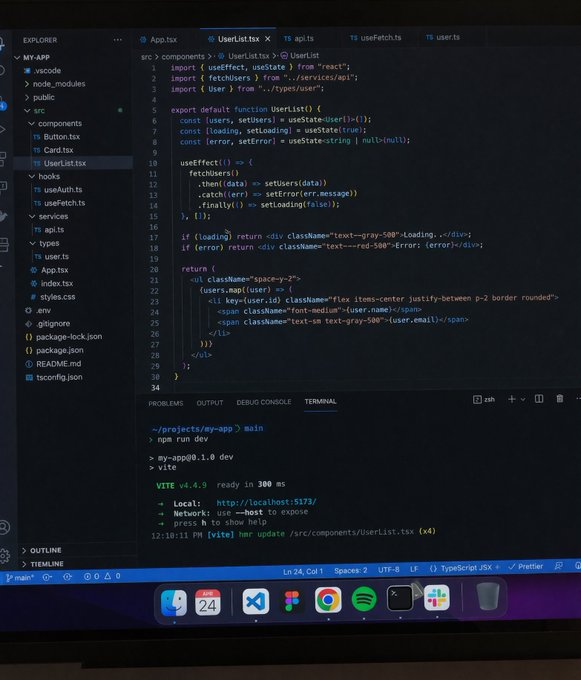
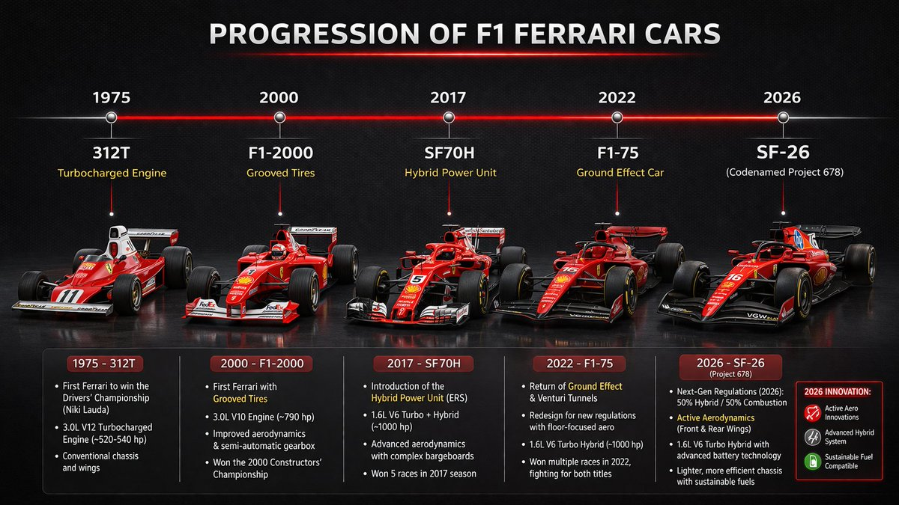
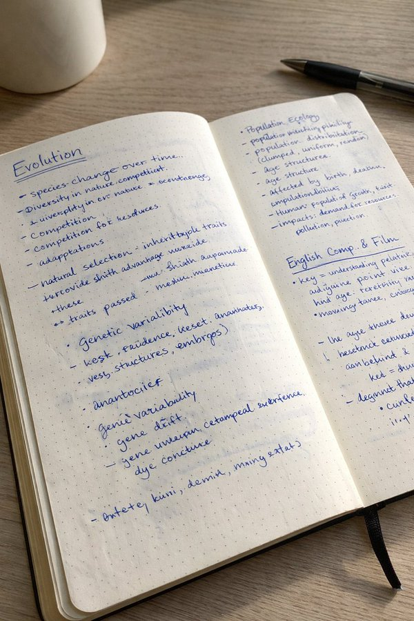
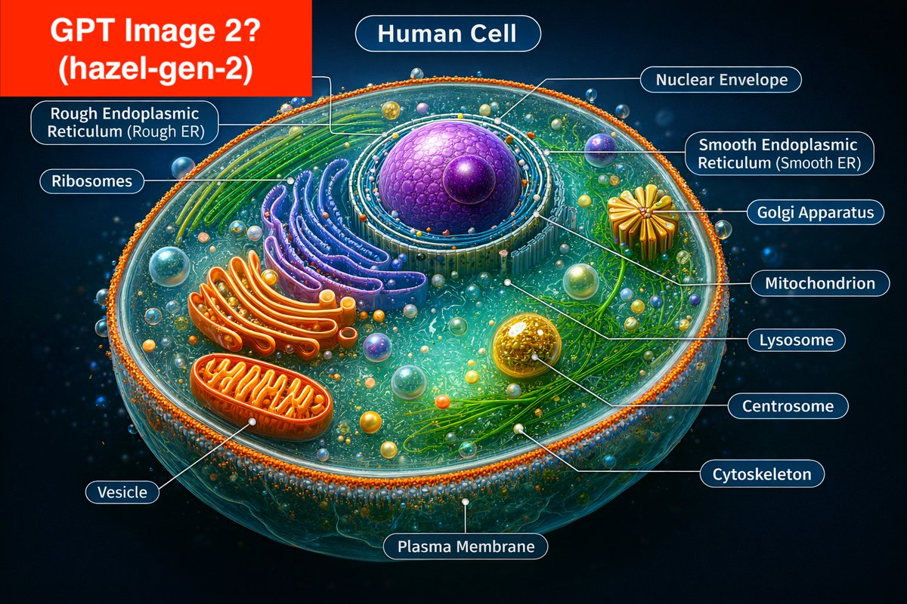
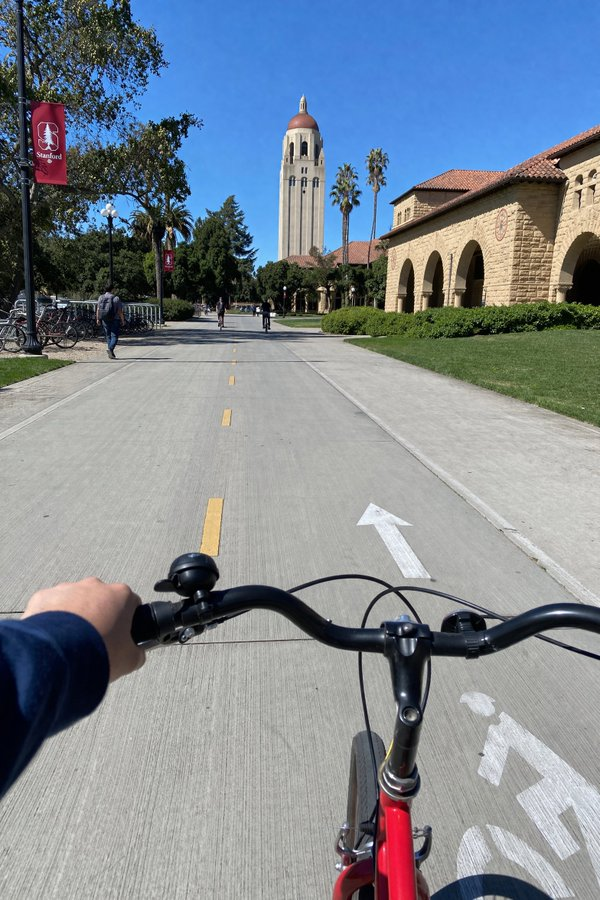
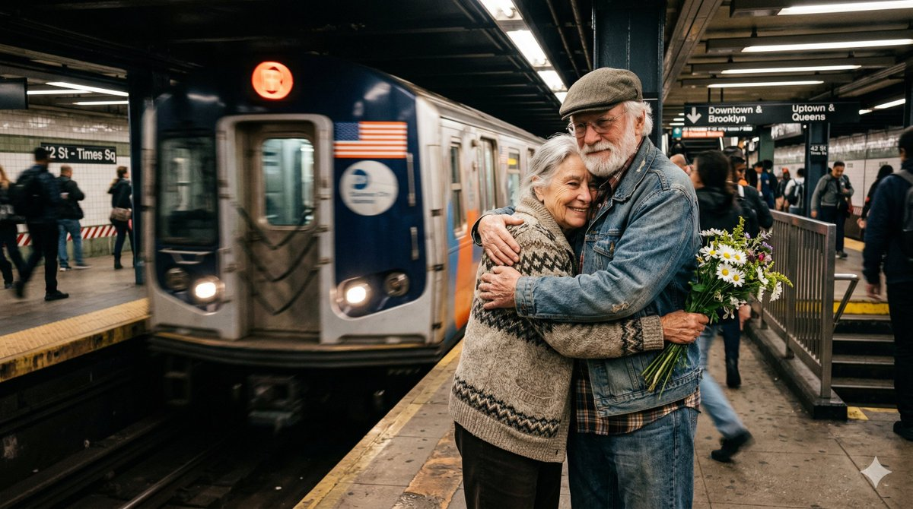
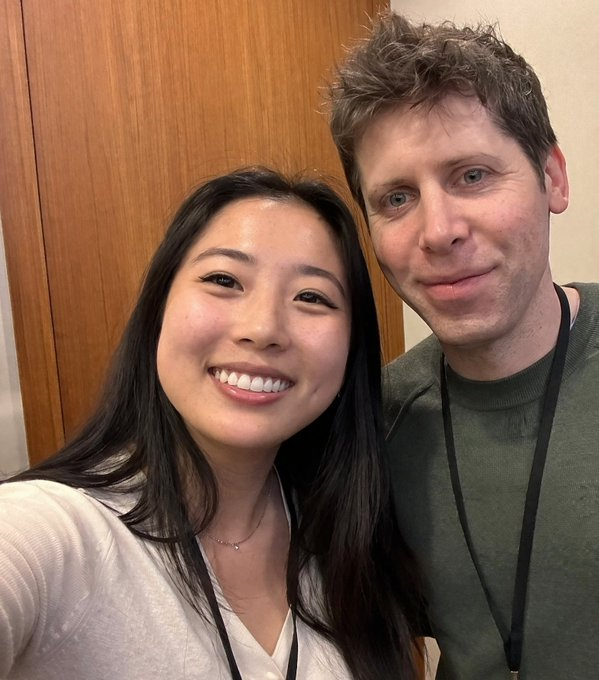

# GPT-Image-2 X Prompt Pairs

Curated GPT-Image-2 prompt-image pairs sourced primarily from X.

Snapshot date: 2026-04-17.

This page is the browse layer.

The flat reusable dataset lives in [data/gpt-image-2/x-prompt-image-pairs.json](../../data/gpt-image-2/x-prompt-image-pairs.json).

## Latest Additions: 2026-04-15 To 2026-04-17

Recent sweep results:

- 20 verified X posts
- 22 prompt-image pairs
- fresh additions include direct prompt posts from `@patrickassale`, `@BubbleBrain`, `@WolfRiccardo`, `@itnavi2022`, `@johnAGI168`, `@marumero_music`, and others
- one UI-design case from `@qiufenghyf` used OCR on an attached prompt screenshot, so it is marked `medium` confidence
- five `@SRKDAN` prompt records were recovered from the author's own reply threads, so they are marked `visible_in_thread_reply`

## Gallery

| 1 | 2 | 3 |
| --- | --- | --- |
|  |  |  |
|  |  |  |
|  |  |  |
|  |  |  |

## Fresh Examples

### Modern SaaS Homepage Design Boards

- Prompt: `modern SaaS website homepage, figma style, clean navigation bar, hero section with floating prompt input UI, rounded card, soft shadow, minimal design`
- Source: [秋风_irwin on X](https://x.com/qiufenghyf/status/2044982293497090128)
- Published: 2026-04-17
- Mapping confidence: medium

### Douyin Tiktok Convenience Store Portrait

- Prompt: `A 22-year-old East Asian girl... Background: blurred Japanese convenience store interior at night... Douyin/TikTok influencer portrait...`
- Source: [John on X](https://x.com/johnAGI168/status/2044985082868281487)
- Published: 2026-04-17
- Mapping confidence: high

### White Studio Tennis Editorial Portrait

- Prompt: `Professional studio fashion photography, ultra-clean high-end digital editorial portrait in a pure white seamless cyclorama photography studio...`
- Source: [BubbleBrain on X](https://x.com/BubbleBrain/status/2044846335728467996)
- Published: 2026-04-16
- Mapping confidence: high

## Featured Pairs

### Average Engineer's Screen

- Prompt: `average engineer's screen`
- Source: [Curious Refuge on X](https://x.com/CuriousRefuge/status/2043821402940420309)
- Published: 2026-04-14
- Mapping confidence: medium

### F1 Ferrari Progression Infographic

- Prompt: `Infographic which shows the progression of F1 Ferrari cars from old to latest new 2026 Ferrari Formula 1 car, the SF-26 (codenamed Project 678), which was officially revealed on January 23, 2026.`
- Source: [TeksEdge on X](https://x.com/TeksEdge/status/2040489463550529755)
- Published: 2026-04-05
- Mapping confidence: high

### Handwritten Notebook Notes

- Prompt: `A realistic photo of an open dotted notebook lying flat, filled with dense handwritten notes in blue ballpoint pen. The handwriting is casual and slightly messy, like study notes, natural imperfections, crossed out words, underlined headings. Shot from slightly above, natural daylight from a window, no flash. Casual desk setting, shot on iPhone.`
- Source: [Patrick on X](https://x.com/patrickassale/status/2043600177756586428)
- Published: 2026-04-13
- Mapping confidence: high

### Yahoo Homepage Screenshot

- Prompt: `Screenshot of the Yahoo homepage.`
- Source: [Patrick on X](https://x.com/patrickassale/status/2043495406315954213)
- Published: 2026-04-13
- Mapping confidence: high

### Snapshot From Actual Anime

- Prompt: `Show me the attached image as a snapshot from an actual anime`
- Source: [Thereallo on X](https://x.com/Thereallo1026/status/2044241997163311569)
- Published: 2026-04-15
- Mapping confidence: medium

### Fully Labeled Human Cell

- Prompt: `Create a fully labeled diagram of a human cell with at least 10 labeled elements. Make sure these labels are precise and accurate.`
- Source: [Simon Smith on X](https://x.com/_simonsmith/status/1998828165951635545)
- Published: 2025-12-11
- Mapping confidence: high

### Front Page Of A Newspaper

- Prompt: `Generate an image of the front page of a newspaper for today that includes today's top news headlines.`
- Source: [Simon Smith on X](https://x.com/_simonsmith/status/1998778811127595081)
- Published: 2025-12-10
- Mapping confidence: high

### POV Biker Stanford Campus

- Prompt: `POV from a biker riding around the Stanford campus`
- Source: [Curious Refuge on X](https://x.com/CuriousRefuge/status/2043821405633188197)
- Published: 2026-04-14
- Mapping confidence: medium

### Raw iPhone Subway Hugging Couple

- Prompt: `Create a completely RAW quality, unprocessed, unedited image with full iPhone camera quality. A subway station in USA, a momentary blur. The subway is in motion. In front of the subway, there is an elderly woman and man holding daisies. They are hugging.`
- Source: [Riccardo Wolf on X](https://x.com/WolfRiccardo/status/2041192232623972441)
- Published: 2026-04-07
- Mapping confidence: high

### Young Woman Taking Selfie With Sam Altman

- Prompt: `young woman taking selfie with Sam Altman`
- Source: [Justine Moore on X](https://x.com/venturetwins/status/2040273845748449724)
- Published: 2026-04-04
- Mapping confidence: medium
- Note: arena-stage inference, kept separate from the 24 verified direct-discussion pairs
